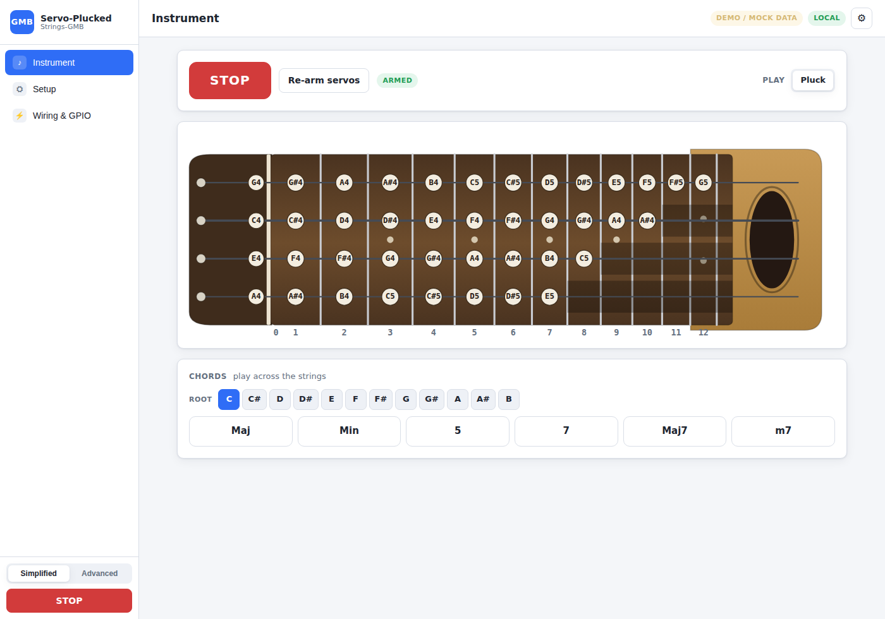
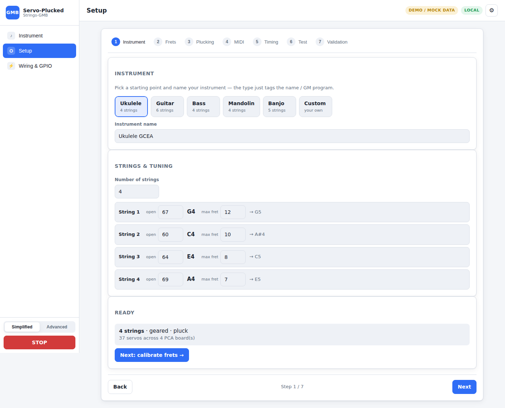
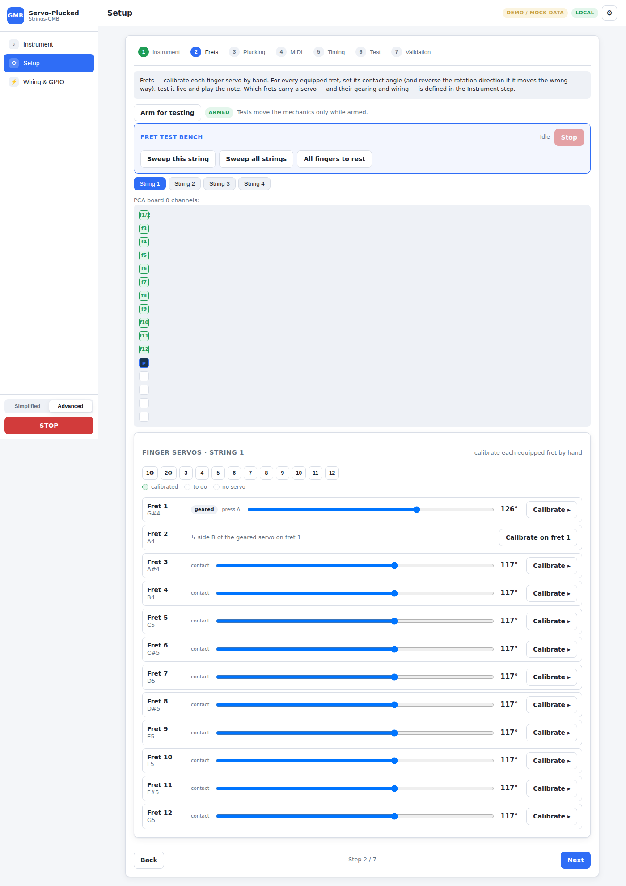
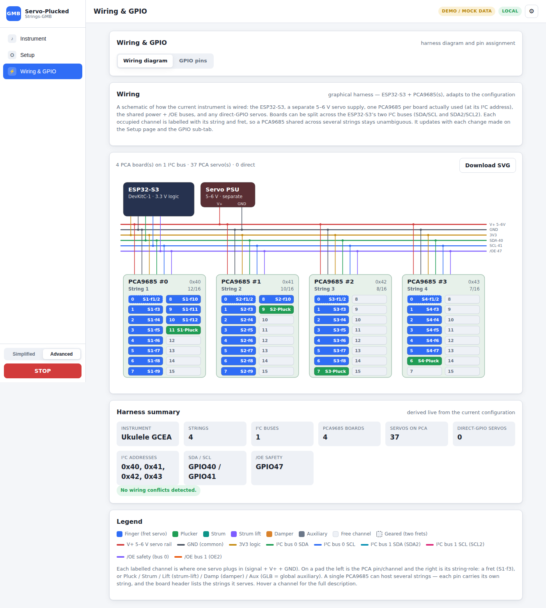
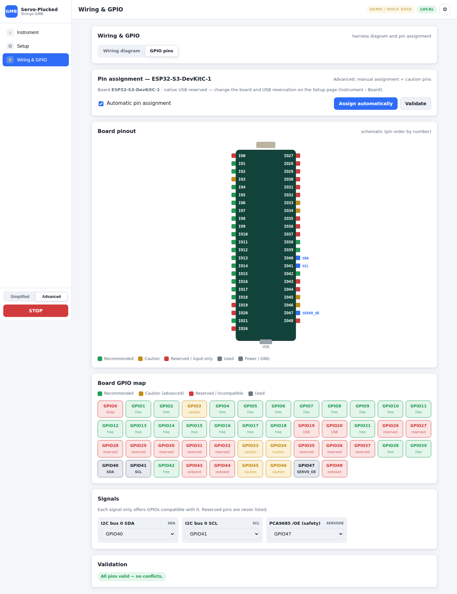

# Servo-Plucked-Strings-GMB

> **ESP32-S3** firmware for a MIDI-controlled plucked-string instrument where
> **every fret position has its own dedicated servomotor**. Everything is
> configured from a **web page** in the browser — no stepper motor, no carriage,
> no code to recompile.

[](LICENSE)
[](https://www.espressif.com/en/products/socs/esp32-s3)
[](https://platformio.org/)
[-green.svg)](https://www.midi.org/)

**English version** | [Version française](README.md)

## 📖 Description

This project turns a string instrument (guitar, bass, ukulele, mandolin,
banjo…) into an automated, MIDI-controlled instrument. To select a note the
system **does not move** a finger along the string: **each equipped fret has its
own dedicated finger servo**. Pressing the target fret's servo stops the string
at that fret; fret 0 is the open string and has no servo. A **pluck servo** (or
strummer) then sets the string in vibration.

Note pitch is purely electrical:

```text
note = openNote + fret + capo + transpose
```

No homing, no millimetre positioning: playing a note comes down to choosing
which finger servo to press.

**Features:**
- 🎸 1 to 6 strings (chords), plucked or strummed instruments
- 🎹 MIDI over Wi-Fi (UDP), CC string/fret selection + GMB SysEx discovery
- 🕹️ Servos on **PCA9685** (I²C) and/or **direct GPIO** (LEDC), mixable per servo
- ⚙️ Geared finger: **one servo for two frets** of the same string
- ⚡ In-rush current management (staggered starts + PWM cut at rest)
- 🌐 Full web interface: configuration wizard, guided calibration, test bench
- 🧪 Pure C++17 core, host-tested on a PC (146 native tests)

## 🎼 How it works

A **string** = several **finger servos** (one per equipped fret) + one **pluck
servo**:

```text
        ┌────────────────────── one string ─────────────────────┐
    nut                                                     bridge
    │  [finger fret1] [finger fret2] [finger fret3] …             │
    ╞════●══════════════●══════════════●═════════════════════════╡  ← the string
    0     1              2              3      (fret positions)
    │                                                             │
    └─ pluck servo: sets the string in vibration ────────────────┘
```

To play a note, the firmware:

1. **releases** the finger currently pressed on the string,
2. **presses** the target fret's finger servo (fret 0 = open string, no finger),
3. **lets it settle**, then
4. **plucks** the string with the pluck servo.

Only one finger is pressed on a string at a time. Up to **6 strings** play in
parallel (chords).

### What is configurable per servo

- **String/fret contact position**: rest angle ↔ press angle (in µs);
- **Rotation direction** (`inverted`) — mount the servo either way around;
- **Arbitrary frets** — equip only the frets you want; gaps are allowed
  (e.g. frets 1, 3, 5, 12);
- **Geared finger** (`fretB`) — **one servo for two frets** of the same string
  (two antagonistic fingers, neutral = both lifted), to halve the servo count on
  the low neck. See [`docs/GEARED_FINGERS.md`](docs/GEARED_FINGERS.md);
- **Source**: a **PCA9685** channel *or* a direct ESP32 **GPIO**, mixable on the
  same instrument.

### Smart current management

Three combined mechanisms keep the 5–6 V rail / the PCA9685 boards from
overloading:

1. **PWM cut at rest** (`disableAtRest`): an idle finger draws ~nothing;
2. **One active finger per string**: the old finger is released before the new
   one is pressed (never two stall torques at once on a string);
3. **Staggered starts** (`ServoActivationGovernor`): on a chord, presses across
   strings are spread out in time (`maxConcurrentMoves`, `staggerMs`) so the
   in-rush current peaks don't stack.

Recommended wiring: **one PCA9685 per string** (its fret fingers + its plucker
fit within 16 channels), up to **8 PCA** boards (addresses 0x40–0x47). The
mapping still stays free per servo.

## 🎹 MIDI reception

- **Notes** over MIDI-over-Wi-Fi (UDP, **port 5006**).
- **Automatic allocation**: send plain notes and they are spread across the
  strings; or **force an exact string/fret** with CCs (tablature):
  `CC20 = string`, `CC21 = fret`, then `Note On`. See
  [`STRING_FRET_SELECTION.md`](STRING_FRET_SELECTION.md) and
  [`docs/MIDI_PROTOCOL.md`](docs/MIDI_PROTOCOL.md).
- A fret **with no servo** is treated as "unavailable": an explicit selection
  then falls back to automatic allocation (configurable policy).
- **CC7 / CC11** (volume / expression) scale the attack, **CC64** is sustain,
  **CC120 / CC123** trigger a panic (software emergency stop).
- **GMB SysEx** (`F0 7D 00 …`): a *General-MIDI-Boop* controller discovers the
  instrument's capabilities (note range, polyphony, CCs, tuning) and adapts. See
  [`SYSEX_CAPABILITIES.md`](SYSEX_CAPABILITIES.md).

## 🖥️ Web interface

All configuration happens in the browser (served by the ESP32, or by opening
`web-interface/index.html` in **demo mode**). The interface is just **three main
pages** — Instrument, Setup, Wiring & GPIO. The **whole instrument creation is one
ordered flow on the Setup page**; only device Wi-Fi and the diagnostic tools live in
the gear modal. Detailed overview of every part:
[`docs/WEB_INTERFACE.md`](docs/WEB_INTERFACE.md#30-the-interface-at-a-glance).

**Instrument** — a GMB-style playable neck: a note-name circle on each equipped
fret and open string, a big emergency STOP + Re-arm, a play-mode selector, and a
chord bar that strums a chord across several strings.
<p align="center"></p>

**Setup** — the complete instrument creation in one flow: **Instrument → Frets →
Plucking → MIDI → Timing → Test → Validation**. Define the instrument (identity,
mechanics, ESP32 board, wiring), calibrate what you defined by hand (contact / stroke
angles + rotation direction), set its MIDI behaviour and timing, then test and save.
<p align="center"></p>
<p align="center"></p>

**Wiring & GPIO** — the current instrument's ESP32 + PCA9685 harness (one or two
I²C buses, addresses, per-pin string·role, live conflict checks), and the
**graphical pinout** of the chosen ESP32 board (S3 / WROOM-32 / DevKit v1) with the
used pins highlighted.
<p align="center"></p>
<p align="center"></p>

## 🔌 Hardware


- **Board**: ESP32-S3-DevKitC-1, ESP32-WROOM-32 (DevKitC 38-pin) or ESP32
  DevKit v1 (30-pin), selectable — the board profile filters usable GPIOs and
  the pinout is shown graphically.
- **Servos**: PWM from a **PCA9685 channel** (I²C, up to 8 boards 0x40–0x47,
  16 channels each) **or** a **direct GPIO** (LEDC, up to 8 servos), mixable per
  servo.
- **Safety**: the PCA `/OE` line (active-low) neutralises all PCA servos
  instantly; direct-GPIO servos are detached on stop. Wire it to a real hardware
  stop button. See [`docs/SAFETY.md`](docs/SAFETY.md).
- **Power**: a **separate** 5–6 V servo rail sized to the servo count (no servo
  powered by the ESP32 regulator).

Details: [`hardware/`](hardware/) (BOM, wiring) and
[`docs/PIN_CONFIGURATION.md`](docs/PIN_CONFIGURATION.md).

## 🚀 Quick start

### 1. Test the logic on a PC (no hardware)

```bash
cd firmware/test
make            # builds the C++ core + the tests, then runs them
```

Expected: `146 tests, … checks, 0 failures`.

### 2. Build / flash the firmware (PlatformIO)

```bash
cd firmware
./sync_web_data.sh          # copies the web interface into the LittleFS image
pio run                     # build ESP32-S3-DevKitC-1
pio run -t uploadfs         # upload the web interface
pio run -t upload           # flash the firmware
```

(Arduino IDE: open `firmware/firmware.ino`; the `src/` folder is compiled
recursively. See [`docs/ARDUINO_IDE_BUILD.md`](docs/ARDUINO_IDE_BUILD.md).)

### 3. First configuration

On first boot the ESP32 creates a Wi-Fi access point
**`Servo-Plucked-Strings-GMB`**. Connect to it, open the board's address in a
browser: the **configuration wizard** guides you (instrument, strings, per-fret
servos), and the **guided calibration** walks you through each finger fret by
fret (press → adjust the contact angle → test the note → next). See
[`docs/FIRST_CONFIGURATION.md`](docs/FIRST_CONFIGURATION.md).

## ✅ Verification

| Check | Command | What it guarantees |
|-------|---------|--------------------|
| Native tests | `cd firmware/test && make` | core logic (MIDI/CC, allocation, per-string FSM, servo-fret config, geared fingers, governor, SysEx) |
| Platform compile | `firmware/test/hostcheck/run.sh` | `main.cpp` + ESP32 adapters compile (stubs) |
| JSON profiles | `firmware/test/profilecheck/run.sh` | all 6 profiles load through the real parser (round-trip) |
| Web interface | open `web-interface/index.html` | wizard + calibration + CC selection (simulated backend) |
| Firmware build | `cd firmware && pio run` | real ESP32-S3 build (PlatformIO toolchain required) |

## 📂 Repository structure

```text
Servo-Plucked-Strings-GMB/
├── firmware/               ESP32-S3 firmware
│   ├── src/core/           Pure C++17 core (MIDI, CC selection, allocation,
│   │                       per-string state machine, governor, SysEx, safety)
│   ├── src/platform/esp32/ ESP32 adapters (Wi-Fi, web server, ServoBank, storage)
│   ├── src/main.cpp        Hardware integration + servo-per-fret scheduler
│   └── test/               Native tests (g++) + hostcheck + profilecheck
├── web-interface/          Web interface (3 pages: Instrument, Setup,
│                           Wiring & GPIO + gear modal for device/diagnostics)
├── instrument-profiles/    Ready-made profiles (ukulele + geared variant, guitar,
│                           bass, mandolin, banjo)
├── board-profiles/         ESP32 board profiles (S3, WROOM-32, DevKit v1)
├── hardware/               BOM, schematics, wiring
├── mechanics/              Mechanical notes (fingers, plucking)
├── docs/                   Detailed guides
├── img/                    Schematics
├── SPECIFICATION.md        Full project specification
├── README.md               French landing page
└── README_EN.md            this file
```

## 📚 Documentation

| Guide | Contents |
|-------|----------|
| [SPECIFICATION.md](SPECIFICATION.md) | Full specification (architecture, capacities, safety, phases) — English |
| [docs/FIRST_CONFIGURATION.md](docs/FIRST_CONFIGURATION.md) | Step-by-step first bring-up — English |
| [docs/CALIBRATION.md](docs/CALIBRATION.md) | Servo-per-fret calibration + install helper — French |
| [docs/GEARED_FINGERS.md](docs/GEARED_FINGERS.md) | Geared fingers (1 servo → 2 frets) — French |
| [docs/PIN_CONFIGURATION.md](docs/PIN_CONFIGURATION.md) | Pins (I²C, /OE, direct servos) — French |
| [docs/NETWORK_HOTSPOT.md](docs/NETWORK_HOTSPOT.md) | Hotspot + captive portal — French |
| [docs/MIDI_PROTOCOL.md](docs/MIDI_PROTOCOL.md) | Notes, CC string/fret selection, SysEx — English |
| [STRING_FRET_SELECTION.md](STRING_FRET_SELECTION.md) | CC selection specification — English |
| [SYSEX_CAPABILITIES.md](SYSEX_CAPABILITIES.md) | Capability-discovery SysEx protocol — English |
| [docs/SAFETY.md](docs/SAFETY.md) | E-stop, /OE, current management — French |
| [docs/ARCHITECTURE.md](docs/ARCHITECTURE.md) | Code organization — English |
| [docs/WEB_INTERFACE.md](docs/WEB_INTERFACE.md) | Interface pages — English |
| [docs/ARDUINO_IDE_BUILD.md](docs/ARDUINO_IDE_BUILD.md) | Building the ESP32 firmware from the Arduino IDE — English |

## 🎛️ The GMB family

The project stays specialized to avoid an overly complex universal firmware. The
note-selection technologies are split across separate repositories:

| Repository | Note selection |
|------------|----------------|
| [Stepper-Plucked-Strings-GMB](https://github.com/glloq/Stepper-Plucked-Strings-GMB) | a stepper motor moves a single finger along each string |
| **Servo-Plucked-Strings-GMB** (this repo) | **one dedicated finger servo per fret position** |
| Solenoid-Plucked-Strings-GMB | one fixed solenoid per fret position |

> ℹ️ The historical **Arduino / MIDIUSB** version (Leonardo + PCA9685) is no
> longer part of this repository: it is maintained separately in a dedicated
> Arduino repository. This repository is now **100 % ESP32-S3**.

## 🚦 Status & limits

- Firmware complete, core verified by the native tests; **not yet validated on a
  physical instrument** (servo timing and current under load to be checked on a
  bench).
- The software E-stop does **not** replace a **hardware** cut of the servo
  supply: wire the PCA `/OE` line to a real stop button. See
  [`docs/SAFETY.md`](docs/SAFETY.md).

## 🤝 Contributing

Contributions are welcome:
- 🐛 report bugs
- 💡 suggest features
- 📖 improve the documentation
- 🔧 submit pull requests

## 📄 License

This project is licensed under the MIT License — see the [LICENSE](LICENSE) file.

## 🙏 Acknowledgments

- [Adafruit](https://www.adafruit.com/) for the PCA9685 library
- [ArduinoJson](https://arduinojson.org/) and [ESPAsyncWebServer](https://github.com/ESP32Async/ESPAsyncWebServer)
- The ESP32 / PlatformIO community

---

**Made with ❤️ for music automation**
