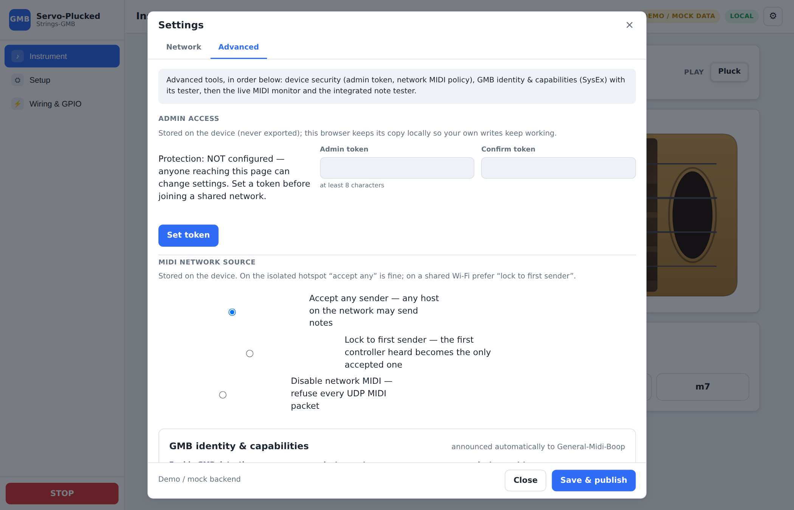

# Web Interface — Servo-Plucked-Strings-GMB

> Sources: `SPECIFICATION.md` §9, §10, §18, §19, §20 · `STRING_FRET_SELECTION.md` §14–16 · `SYSEX_CAPABILITIES.md` §17–18.
> Related documents: [`ARCHITECTURE.md`](ARCHITECTURE.md) · [`PIN_CONFIGURATION.md`](PIN_CONFIGURATION.md) · [`MIDI_PROTOCOL.md`](MIDI_PROTOCOL.md) · [`FIRST_CONFIGURATION.md`](FIRST_CONFIGURATION.md).

The Web interface lets a beginner configure the instrument without modifying the
source code, from a computer, a tablet or a phone. No dedicated application is
required.

---

## 1. One simplified interface

The interface is deliberately **simplified-only** — there is no expert / advanced
toggle. A step-by-step wizard with recommended values, automatic pin assignment,
wiring diagrams, test buttons, automatic validation and understandable error
messages. It shows only the **green** GPIOs (see
[`PIN_CONFIGURATION.md`](PIN_CONFIGURATION.md)) and keeps each step to the few
choices that matter: per-servo you set the **PCA board + pin** and the **angle(s)**
right where you calibrate. The servo's mechanical **pulse window**
(`pulseMinUs`/`pulseMaxUs`) is never surfaced — the angles are converted against it —
and travel/settle appear only where they change the gesture (the Plucking step).

---

## 2. Setup — the complete instrument flow (7 steps, §10)

The **whole creation of an instrument is one ordered flow on the Setup page** (no
setting is split between a page and a modal): define it, calibrate what you defined,
set its MIDI behaviour and timing, test it and save. Only device Wi-Fi and the
diagnostic tools live in the gear modal.

| Step | Title | Content |
| ----- | ----- | ------- |
| 1 | **Instrument** | Pick a **preset** (ukulele/guitar/bass/mandolin/banjo/custom — type is cosmetic), name it, set **strings & tuning** (count 1–6, per-string open note + max fret), and the **Board** — the **ESP32 board selector** (S3-DevKitC-1 v1.0 / v1.1, WROOM-32, DevKit v1 — the two S3 revisions are separate boards, their RGB-LED pin differs) + native-USB reserve. A preset produces a working instrument and the wiring is (re)generated automatically; the mechanics live per-servo on the Frets / Plucking steps |
| 2 | **Frets** | the **finger servos**, per string (string-tab strip). A clickable **coverage strip** shows which frets carry a servo (geared marked ⚙); **tap a fret** to open its **servo div** — a **"One servo drives 2 frets (geared)"** toggle, its **PCA board + pin**, the **angle(s)** set with precise **− / + steppers** (a geared servo shows both press angles; its rest sits at their midpoint automatically), and the **rotation direction**. Every change drives the servo live; **play the note** to check. An open-only string shows a one-click *Equip frets*. A **test bench** sweeps one string or all strings |
| 3 | **Plucking** | one **sounding servo** per string: its **PCA board + pin**, the **contact / down-stroke / up-stroke angles**, per-plectrum **alternation** and **rotation direction**, travel/settle, the **mute** policy (source, hold, plectrum mute angle) and the global **gesture** (stroke duration, minimum strike depth). Plus the optional per-string extras: a **descent servo** (rest/play angles, direction, travel, engage delay, lower- or raise-to-play) and a **damper servo** (rest/damp angles, direction, travel). A **test bench** plucks every open string and sweeps the strum servos |
| 4 | **MIDI** | two cards. **MIDI parameters** — global channel, Omni, velocity curve. **String / fret selection** — an *Enable string/fret selection* toggle and an **Apply General-Midi-Boop preset** button (**CC20 selects the string**, **CC21 the fret**, before a Note On). The live MIDI monitor + tester stay in the gear modal (Advanced) |
| 5 | **Timing** | two cards. **Timing** — the two global delays: the **action delay** (fixed-time FIFO buffer) and the **fret → strum delay**, plus the strum lead. **Current management** — an **optional** governor (a toggle turns it off): cap how many servos start moving at once **whole-instrument** and **per PCA board** (each 0 = no cap), plus the stagger between starts |
| 6 | **Test** | play an **open (fret 0)** note and a fretted note on each string (arm first); a full-instrument **test bench**; STOP (panic) |
| 7 | **Validation** | "No problems found" or a precise list of problems; the firmware `ProfileValidator` is authoritative and no actuator is driven until the critical errors are fixed |

**Board** selection lives in the **Instrument** step; **Network** (Wi-Fi) settings are
in the gear modal — they belong to the device, not the instrument. The **automatic
pin assignment** is a button on the **GPIO pins** sub-tab of the *Wiring & GPIO* page;
none of these is a separate setup step.

The per-string steps (**Frets** and **Plucking**) show **one string at a time** via
a string-tab strip, so a 6-string instrument stays navigable. Each servo carries its
own **PCA board + pin**, its **I²C bus** and **angle(s)** right where you calibrate it.

**What the simplified UI does not surface.** The profile carries more MIDI fields than
the interface shows — transpose, chord window, sustain pedal + its CC, chord
**saturation strategy**, and the detailed string/fret selection editor (CC numbers,
numbering, order, missing-CC policy). Since the expert mode was removed these keep
their profile defaults (or whatever an imported JSON sets) and are edited by importing
a profile, not from the screen. The same applies to the **/OE split per bus**
(`SERVO_OE2`): the data model and the firmware support it, but no control creates it —
both buses share a single `/OE`.

**Testing one servo or a group.** The Frets, Plucking and Test steps each carry an
**Arm** control and a **test bench**: single-servo buttons, plus group tests (sweep
every fret of a string or all strings, pluck every open string, sweep every strum
servo, test everything) run through a cancellable client-side sequencer with a live
status line and a **Stop** button.

The step-by-step detail is in [`FIRST_CONFIGURATION.md`](FIRST_CONFIGURATION.md).

**Geared (paired) fingers.** On the *Frets* step, a fret's servo div offers a
**"One servo drives 2 frets (geared)"** toggle: one servo then presses two antagonistic
frets through a gear (side A = `fret`, side B = `fretB`). The div shows **both press
angles** (one per fret); the **rest sits at their midpoint automatically** (both
fingers lifted). The paired fret's own row shows *"paired with fret N on one geared
servo"*. Full study and calibration procedure:
[`GEARED_FINGERS.md`](GEARED_FINGERS.md).

**Gear modal (device only).** A gear button (⚙) in the top bar opens the device
**Settings** modal — now just two tabs, since the whole instrument setup moved to the
Setup page: **Network** (mode / SSIDs / hostname, a **Scan networks** picker,
write-only Wi-Fi passwords, and a **Start hotspot now** button) and **Advanced**
(device security — admin token and UDP MIDI source policy — then GMB identity &
capabilities / SysEx tester and the live MIDI monitor + tester). Network
settings are **device state**: saving stores them in NVS (independently of any
profile slot, so they survive reboots and profile changes) and applies them
immediately, with the automatic hotspot fallback if the connection fails. Picking
an open network needs no password; "Forget the stored station password" really
erases the stored secret (a blank field keeps it). The hotspot button switches to
the access point immediately. See [`NETWORK_HOTSPOT.md`](NETWORK_HOTSPOT.md).
The per-fret contact-angle calibration on the Frets step is detailed in
[`CALIBRATION.md`](CALIBRATION.md).

---

## 3. Interface pages

### 3.0 The interface at a glance

Overview of the interface (standalone **demo data** — a 4-string GCEA ukulele).
All views are **adaptive**: they redraw from the active profile. The sidebar keeps
**three main pages**: the playable **Instrument**, the complete **Setup** flow (the
whole instrument creation in order), and the **Wiring & GPIO** reference. Only device
Wi-Fi and the diagnostic tools live in the gear modal (top-right).

#### Main page 1 — Instrument

A clean playable neck (GMB-style): a note-name circle on each equipped fret and the
open string, press-and-hold to play. A big emergency **STOP** + Re-arm and the
play-mode selector sit on top; a chord bar below strums common chords across the strings.
<p align="center"></p>

#### Main page 2 — Setup

The **whole instrument creation, in one ordered flow**: Instrument → Frets →
Plucking → MIDI → Timing → Test → Validation. Define the instrument, calibrate what
you defined, set its MIDI behaviour and timing, then test and save — nothing is split
across a page and a modal.

**Instrument** — minimal: pick a preset, name it, set the tuning, pick the ESP32
board; the servo wiring is (re)generated automatically (no mechanics to wade through):
<p align="center"></p>

**Frets** — tap a fret to open its servo div: the geared (2-fret) toggle, its PCA
board + pin, the angle(s) on precise − / + steppers, and the rotation direction (a
geared servo shows both press angles; its rest is their midpoint):
<p align="center"></p>

**Plucking** — one sounding servo per string: PCA board + pin, contact / down-stroke /
up-stroke angles with per-plectrum alternation and direction, the mute policy and
angle, plus optional descent and damper servos:
<p align="center"></p>

**MIDI** — global channel, Omni and velocity curve, then the string/fret selection
toggle + the General-Midi-Boop preset button:
<p align="center"></p>

**Timing** — the two global delays (action delay / FIFO buffer, fret → strum delay, strum lead) + the **optional** PCA9685 in-rush governor (whole-instrument and per-board caps):
<p align="center"></p>

**Test** — full-instrument group tests: play every open string, sweep every finger / plucker, run a scale, test everything; below them a per-string quick play (open + fret 5) and the STOP (panic) button:
<p align="center"></p>

**Validation** — the last step: `ProfileValidator`'s verdict, then **Save & publish**:
<p align="center"></p>

#### Main page 3 — Wiring & GPIO

Five sub-tabs — the electrical installation assistant of the build:

**Harness** — the adaptive ESP32 + PCA9685 harness map: one or two I²C buses, boards
at their address, per-pin string·role, live conflict checks (a missing `/OE` is an
**error** — the profile cannot arm — and a missing hardware E-stop declaration is
flagged), SVG export — plus a **Power wiring** card: run a **direct line from the
supply to each PCA9685** (star wiring, no daisy-chaining, fused per branch), add a
**bulk capacitor** at each board's V+/GND sized to how many micro-servos start at
once (**~4 → 1000–2200 µF**, **~8 → 2200–4700 µF**, **~16 → 4700–10000 µF** —
empirical micro-servo starting values; size from datasheet peaks with C ≈ I·Δt/ΔV
and confirm at the bench) with a **100 nF ceramic** in parallel to filter HF noise
(limits ESP32 crashes on a shared supply), and make `/OE` **fail-safe** (pull-up +
E-stop chain — `hardware/POWER_AND_SAFETY.md`). A per-board table sizes the caps from
each board's worst-case simultaneous starts (which the Timing step's per-board cap bounds).
<p align="center"></p>

**Power & safety** — the reference circuit of `hardware/POWER_AND_SAFETY.md` applied
live to the instrument: a **Safety chain** card mixing derived facts (`/OE` GPIO,
hardware E-stop + contact wiring) with the **fitted-on-the-machine declarations**
(`/OE` pull-up, gated enable stage, E-stop contactor, main + branch fuses — stored in
the profile's `hardware` block, documentation-only); a **power tree** SVG (PSU → main
fuse → master switch → E-stop contactor → star distribution → fused branch + bulk cap
per PCA → `/OE` bus and E-stop contacts) where **undeclared elements draw dashed**;
and a **Current & supply estimator**: from fleet-typical idle/moving/stall currents
and the governor caps it derives per-branch worst case, a fuse guide, a bulk-cap
suggestion (C ≈ I·Δt/ΔV with editable Δt/ΔV), the PSU requirement, and a wire
voltage-drop calculator.
<p align="center"></p>

**I²C & PCA** — per bus: SDA/SCL pins, every board with its address and **A0–A2
solder-jumper setting**, and the **pull-up budget**: declare each breakout's on-board
pull-ups (0 = removed) plus an optional external pair, and the page computes the
**equivalent per line** (parallel resistors add) and grades it against the target
window (one equivalent 2.2–4.7 kΩ per bus line — `hardware/I2C_PCA9685.md` §3).
<p align="center"></p>

**Commissioning** — the staged power-up checklist of `hardware/COMMISSIONING.md`
(stage gates, E-stop tests, per-branch bring-up) with per-instrument progress kept
in the browser. Each stage is a **gate**: it stays greyed out (*blocked by the
previous gate*) until every box of the stage before it is ticked.
<p align="center"></p>

**GPIO pins** — the board GPIO map + per-signal assignment with a **graphical board pinout** that
highlights the used pins, plus the **Emergency stop input** card: declare the hardware
E-stop, pick its contact wiring (**normally closed recommended** — a press, a cut wire
or an unplugged connector all read as STOP) and its `ESTOP` GPIO. The board itself is
chosen on the Setup page (Instrument → Board — DevKitC-1 v1.0 and v1.1 are separate
boards, their RGB-LED pin differs); this reference page shows it read-only and
assigns pins on it.
<p align="center"></p>

#### Gear modal (device only)

**Network** — network mode, SSIDs, hostname, write-only Wi-Fi credentials and the hotspot switch:
<p align="center"></p>

**Advanced** — one scrolling tab holding all the device-side diagnostics. It opens on
**device security**: the admin-token workflow (set / unlock this browser, with a
banner when no token protects the device) and the **MIDI network source** posture
(accept any sender · lock to the first sender · disable network MIDI):
<p align="center"></p>

Scrolling down: **GMB identity & capabilities**, the read-only computed capabilities,
the advanced GMB blocks and the **SysEx tester**:
<p align="center"></p>

And at the bottom, the live **MIDI monitor** + the **integrated test tool**:
<p align="center"></p>

Profiles are intentionally not exposed (a hidden, non-user setting).

### 3.1 Status surfaced in the UI (§19)

There is **no separate dashboard page**. The state a player needs is folded into the
top of the **Instrument** page and into every step that drives hardware:

```text
STOP (panic) · Re-arm servos · Armed / Not armed badge · play mode
+ a DEMO / MOCK DATA badge and the connection badge in the top bar
```

The Frets / Plucking / Test steps repeat the same **Arm** control and armed badge,
plus a live status line for the running test sequence.

The **full per-string dashboard of §19** (per-string state machine, current note and
fret, finger up/down, plectrum strike/rest, last fault, notes playing, active faults)
is **not** rendered as a page: the data is published by `GET /api/status` and
`WS /ws/status`, and is read by the UI only to decide *armed / not armed*. There is no
carriage position, HOME/LIMIT or temperature/voltage readout — the servo-per-fret
firmware emits none.

### 3.2 String/fret selection (STRING_FRET_SELECTION §14–16)

On the **Setup → MIDI** step the simplified-only interface keeps two controls:

```text
[✓] Enable string/fret selection
[ Apply General-Midi-Boop preset ]
Hybrid (recommended): use CCs when valid, fall back to automatic allocation otherwise.
```

The CC-level settings of §14 (**System used**, **String CC** / **Fret CC**, string
numbering, string order, *When CC is absent*) and the advanced panel (offsets, tables,
policies) exist in the profile and in `midiselect.js`, but the expert mode that
rendered them was removed — the preset button writes the General-Midi-Boop values
(CC20 = string, CC21 = fret, hybrid) and imported JSON can set the rest. See
[`MIDI_PROTOCOL.md`](MIDI_PROTOCOL.md) §2.

The monitor and the tester below are in the **gear modal → Advanced**, not on this
step.

**Web MIDI monitor (§15)** — real time:

| Time | Channel | Message | Value | Interpretation |
| ----: | ----: | ------- | -----: | -------------- |
| 0 ms | 1 | CC20 | 3 | string 3 |
| 1 ms | 1 | CC21 | 5 | fret 5 |
| 2 ms | 1 | Note On 60 | 100 | string 3, fret 5 |

Also displays: complete / pending / expired selection, invalid value, automatic
allocation used, note/fret mismatch, actual physical string. A button to clear
the log.

**Built-in test tool (§16)** — choose string, fret, MIDI note, velocity,
channel; automatically sends string CC → fret CC → Note On → Note Off after a
chosen duration, and displays each step (CC received, selection validated, finger
pressed, string plucked).

### 3.3 GMB identity and capabilities (SysEx §17–18)

Path: **gear modal (⚙) → Advanced**, below the device-security section.

**Identity (§17.1)**: enabling GMB detection, instrument name, type, GM program,
MIDI channel, the **Publish capabilities** and **Test communication** buttons, and
the status of the last detection. Computed capabilities, read-only:

```text
Strings: 4 · Frets: 12 · MIDI range: C4 – G5 (60–79) · Note mode: continuous
Polyphony: 4 (auto) · CC string: 20 · CC fret: 21 · Tuning: G4 C4 E4 A4 · Revision: 7
```

**Advanced GMB options (§17.2)**, on the same tab: enabling blocks 5/6/7, the block 7
version (v1 compatible / v2 extended), the polyphony override, the list of announced
CCs, plus **View raw SysEx bytes** and **Send change notification (block 0x11)**.
There is no "regenerate device id": the v2 `instance_id` is derived from the ESP32
MAC and is stable by design.

**SysEx tester (§18)**: **GMB descriptor (v2)** · **Request identity (v2 handshake)**
· **Notify change** · **Request capabilities (v1)** · **Request string config (v1)** ·
**Full discovery**. For each test: message sent, message received, decoding of fields,
7-bit validity, length, possible error, response time. Protocol details in
[`MIDI_PROTOCOL.md`](MIDI_PROTOCOL.md) §3.

### 3.4 MIDI settings (§18)

**On screen** (Setup → MIDI): global channel, Omni mode, velocity curve
(linear / soft / hard / exponential — there is no *custom* option, no custom curve
table exists yet).

**In the profile only** (no control renders them since the expert mode was removed —
they keep their defaults or come from an imported JSON): transposition, chord grouping
window, Note Off behaviour, sustain pedal + its CC number, and the chord **saturation
strategy** (see `NoteAllocator`, [`ARCHITECTURE.md`](ARCHITECTURE.md)). Velocity acts
on the plectrum attack depth between `restUs` and `activeUs`.

### 3.5 Profiles (§20)

Up to **8 profile slots** — create, copy, rename, delete, export, import, restore, set
the startup slot. `profiles.js` implements the whole view and the REST routes below
are live, but **no page mounts it**: profile management is deliberately hidden from
the UI. The instrument is saved with **Save & publish**, which activates it and
publishes the capabilities. The slots stay reachable through the API.

**JSON** exchange format:

```json
{
  "project": "Servo-Plucked-Strings-GMB",
  "profileVersion": 1,
  "capabilitiesRevision": 1,
  "instrument": { "name": "Ukulele GCEA", "stringCount": 4, "type": "ukulele" },
  "board": { "profile": "esp32-s3-devkitc-1", "reserveUsb": true },
  "network": { "mode": "accessPoint", "apSsid": "Servo-Plucked-Strings-GMB", "hostname": "gmb-ukulele" },
  "power": { "maxConcurrentMoves": 3, "maxConcurrentPerBoard": 0, "staggerMs": 8 },
  "strings": [ { "enabled": true, "openNote": 67, "maxFret": 12 } ],
  "servos": [
    { "function": "finger", "stringIndex": 0, "fret": 1,
      "source": "pca", "pcaBoard": 0, "channel": 0, "restUs": 1000, "activeUs": 1800 }
  ]
}
```

The Wi-Fi password **never** appears in ordinary exports (unless an explicit
option is set).

### 3.6 Instrument — playable neck

Once the instrument is defined and calibrated, the **Instrument** page (the sidebar's
first entry, and the landing page) turns it into a clickable **keyboard**. It draws the neck as a stylised instrument (headstock +
tuning pegs, wood fretboard, body with a soundhole) with the strings and fret wires
laid out **to scale** — the fret spacing follows equal temperament
(`d(n) = 1 − 2^(−n/12)`, the *rule of 18*), so the neck compresses toward the body
like a real fretboard.

```text
open note ─┐        fret 1   2    3     …          soundhole
 (nut)     │  [f1]  [f2]  [f3] …  ← finger-servo pads, just before each wire
  G4 ●═════╪════●═════●═════●══════════════════════════  ← string (lights up when played)
```

* **Servos as pads** — each equipped fret shows its finger servo as a rectangle on the
  string, just on the nut side of the fret wire; a **geared** finger shows a dashed pad
  on both of its frets; frets with no servo are inert.
* **Press-and-hold to play** — pressing a fret with a servo drives its **finger servo**
  to the calibrated contact pulse and **sounds the string** (the played string changes
  colour); **releasing** lifts the finger. The zone left of the nut plays the **open
  string** (fret 0). One finger per string at a time; multi-touch plays chords.
* **Play mode** — only the mechanically-feasible options are offered: **Pluck** always,
  **Up-stroke** / **Alternate** for a *strum* servo, **Muted** when a *damper* exists.
  A *strum lift* is lowered for the stroke and raised again.
* **Chord bar** — pick a root (C … B) and a type (Maj / Min / 5 / 7 / Maj7 / m7): on
  each string the lowest reachable fret of the chord is pressed and the strings are
  struck together.
* Uses the same `POST /api/test/servo` path as the setup flow (works on the device
  **once armed** — a **Re-arm servos** button and an armed badge sit next to the STOP —
  and stand-alone against the mock). Reads the **draft** profile, so an in-progress
  calibration is playable immediately. Leaving the page lifts any held finger, and the
  **STOP (panic)** button (top bar and sidebar) is the safety net.

---

## 4. REST / WebSocket API (`platform/esp32/WebApi.cpp`)

> Implemented by the Web layer (`platform/esp32/WebApi.cpp`). The static UI is served
> from the **copy embedded in the firmware binary** (`WebAssets.cpp`); a LittleFS
> `/www` file, when present, overrides it per file. It exposes the `Profile` /
> `PinManager` / `SafetyManager` / `GmbSysEx` core described in
> [`ARCHITECTURE.md`](ARCHITECTURE.md).

### 4.1 REST endpoints

| Method | Endpoint | Role |
| ------- | -------- | ---- |
| `GET` | `/api/status` | overall status + per string (dashboard §19) |
| `GET` | `/api/commands?id=N` | poll the outcome of a `202`-accepted command (queued / succeeded / refused / unknown) |
| `GET` | `/api/capabilities` | current capabilities snapshot (read-only) |
| `GET` | `/api/board/{id}` | board profile + GPIO capabilities (colors, filtering) |
| `POST` | `/api/pins/auto` | auto-assign the board pins (SDA / SCL / SERVO_OE) for the draft |
| `POST` | `/api/pins/validate` | validate the full profile → list of issues |
| `GET` | `/api/profile` | active profile (JSON) |
| `PUT` | `/api/profile` | replace the profile (draft → validation → activation) |
| `GET` | `/api/profiles` | list of saved profile slots |
| `POST` | `/api/profiles` | save the profile to a numbered slot (`{slot, profile, startup}`) |
| `POST` | `/api/profiles/load` | activate a stored slot |
| `POST` | `/api/profiles/read` | read a slot **without** activating it (copy / rename / set-startup) |
| `POST` | `/api/profiles/delete` | delete a slot |
| `POST` | `/api/reset` | recover from panic / E-stop and re-arm |
| `POST` | `/api/panic` | software panic (`SafetyManager::panic`) |
| `POST` | `/api/test/note` | play a test note (channel, note, velocity, durationMs); armed only |
| `POST` | `/api/test/servo` | drive a servo to rest/active, or to an exact `us` pulse and hold it (live calibration, incl. a geared finger's side B); armed only |
| `POST` | `/api/hotspot` | switch to the access point + captive portal now (see [`NETWORK_HOTSPOT.md`](NETWORK_HOTSPOT.md)) |
| `POST` | `/api/wifi` | store device network settings (mode/SSID/hostname) + write-only credentials in NVS; `apply:true` reconnects now, `clearStationPassword` erases the stored secret |
| `GET` | `/api/wifi/scan` | latest Wi-Fi survey `{scanning, networks:[{ssid,rssi,secure,channel}]}`; `?start=1` kicks a fresh scan |
| `POST` | `/api/midi/source` | UDP MIDI source posture: `{policy: "open"\|"lockToFirst"\|"disabled", unlock: bool}` — stored device-side (NVS), applied live |
| `POST` | `/api/auth` | set the admin token (first-run bootstrap allowed) |
| `POST` | `/api/auth/check` | test a candidate admin token (200 = right, 401 = wrong); never changes the stored one |
| `POST` | `/api/storage/format` | deliberate LittleFS reformat |
| `POST` | `/api/sysex/request` | run a GMB SysEx buffer → decoded response |
| `GET` | `/api/diagnostics` | runtime telemetry snapshot (§4.3) |
| `GET` | `/gmb/descriptor.json` | GMB v2 descriptor served to a General-Midi-Boop controller |

There are **no** stepper `jog` / `endstop` routes: servo-per-fret has no carriage
or HOME/LIMIT sensors. Per-fret finger calibration uses `POST /api/test/servo`.

### 4.2 WebSocket

| Channel | Role |
| ----- | ---- |
| `WS /ws/midi` | inbound/outbound MIDI stream (MIDI monitor §15) |
| `WS /ws/status` | real-time dashboard and per-string status (§19) |

Notes:

* `PUT /api/profile` follows the draft → `ProfileValidator` → atomic save →
  `capabilitiesRevision` increment → snapshot rebuild → Block 8 notification flow
  (see [`MIDI_PROTOCOL.md`](MIDI_PROTOCOL.md) §3.7). A draft configuration is
  **never** published.
* `POST /api/pins/auto` and `/api/pins/validate` map directly to
  `PinManager::autoAssign` / `validate` (see [`PIN_CONFIGURATION.md`](PIN_CONFIGURATION.md)).
* `POST /api/panic` and the safety state: see [`SAFETY.md`](SAFETY.md).

### 4.3 Diagnostics — `GET /api/diagnostics` (P2.19)

Runtime telemetry for a future physical bench (JSON). Read-only, no auth. The body
is built on the loop side and read as a snapshot by the web task (it never touches
live I2C or state). Fields:

| Champ | Sens |
| ----- | ---- |
| `uptimeMs` / `resetReason` | temps depuis boot / cause du dernier reset |
| `freeHeap` / `minFreeHeap` | tas libre courant / minimum observé |
| `state` | état applicatif (`configSafe`/`parking`/`ready`/…) |
| `midi.events` / `droppedEvents` / `droppedPackets` | événements MIDI ingérés / perdus (overflow) / datagrammes perdus |
| `scheduler.maxLatencyUs` / `jitterUs` / `meanUs` | pire période `loop()`, pire écart, moyenne lissée |
| `cmdQueueHighWater` | profondeur max de la file web→loop |
| `faults` / `servoMoves` / `governorThrottles` / `wifiReconnects` | compteurs cumulés |
| `moveMix.deadline` / `staggerableGranted` / `staggerableDeferred` | répartition des mouvements vue par l'ActuatorManager (frappes sonores jamais throttlées ; positionnements accordés / différés) — P1.6 |
| `pca.used` / `healthy` / `failedBoard` | santé PCA9685 (carte défaillante nommée `bus N / 0x4A`) |

Métriques non encore instrumentées (à ajouter progressivement) : latence par corde,
compteurs par transport MIDI (voir l'abstraction transports, P1.7).
