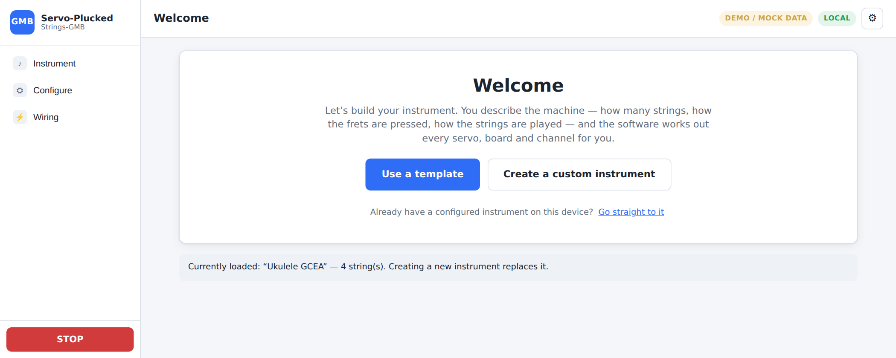
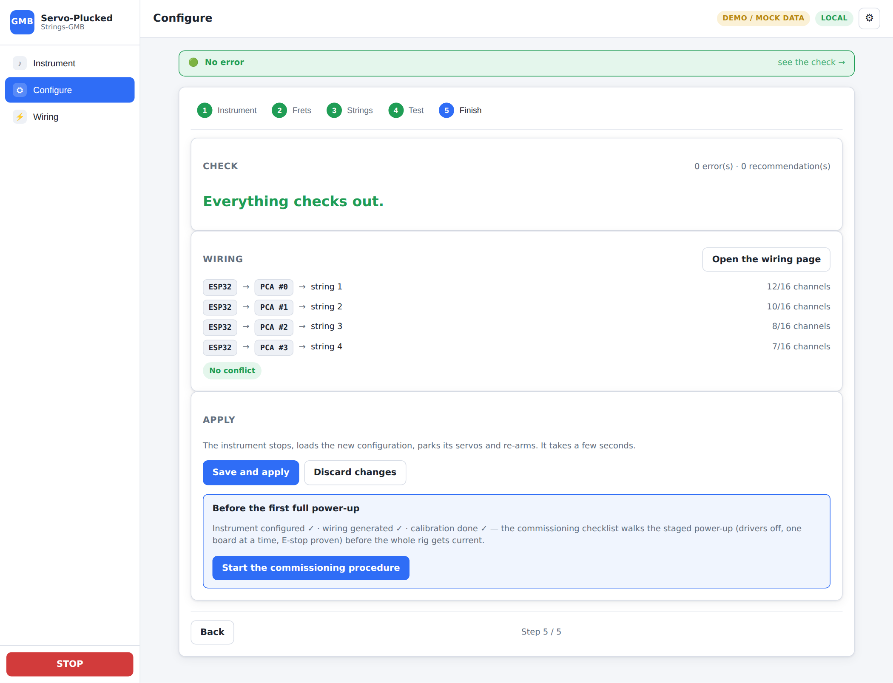
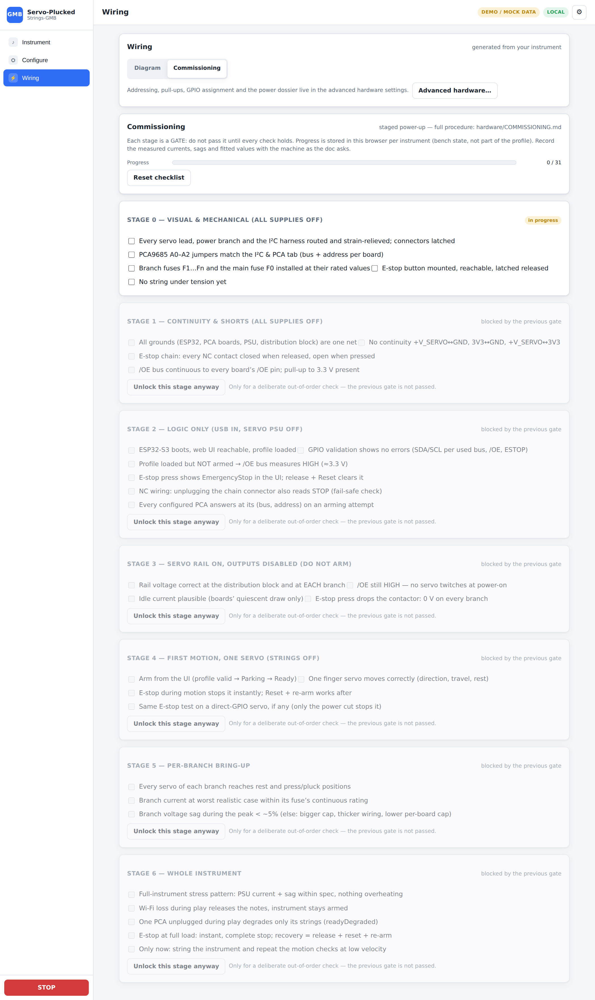
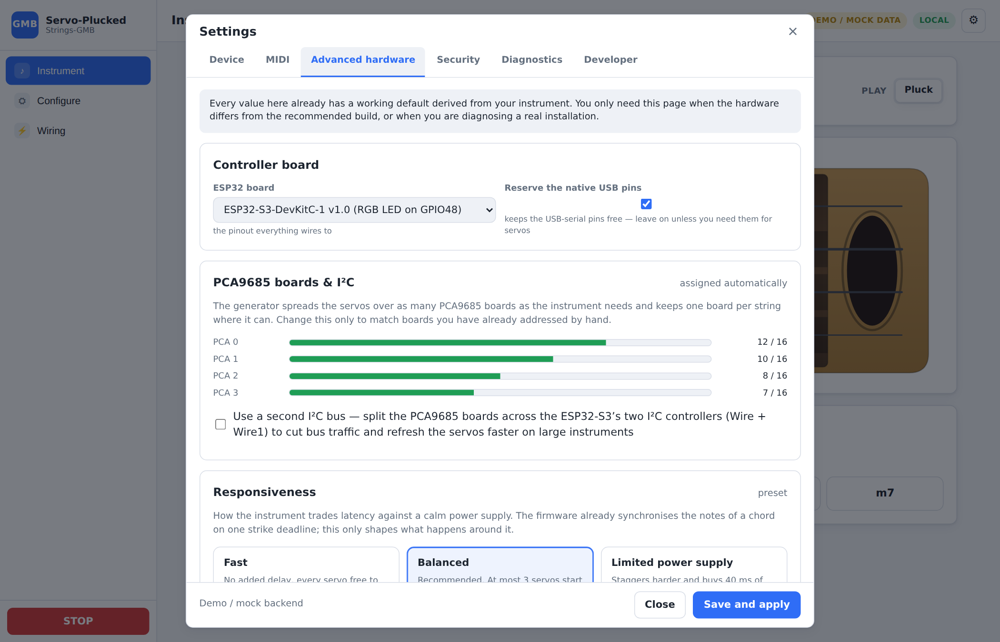
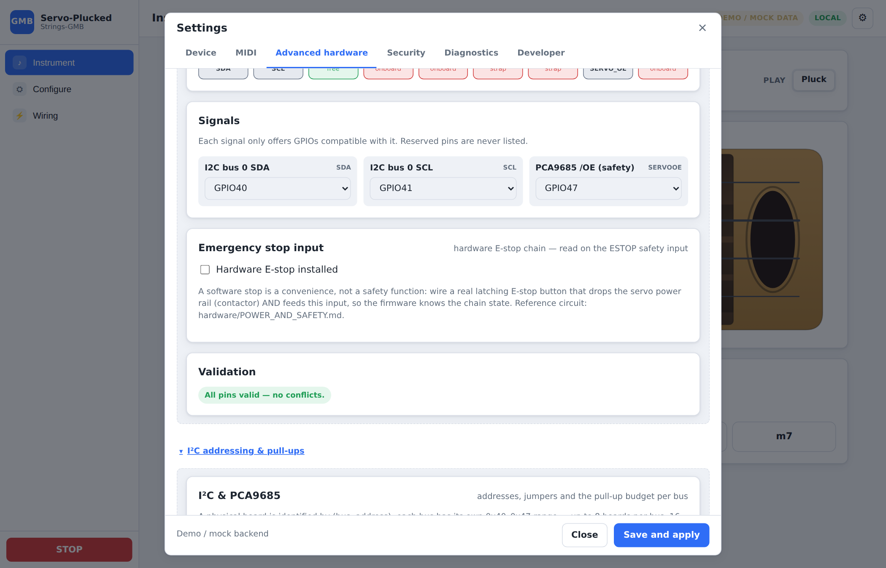
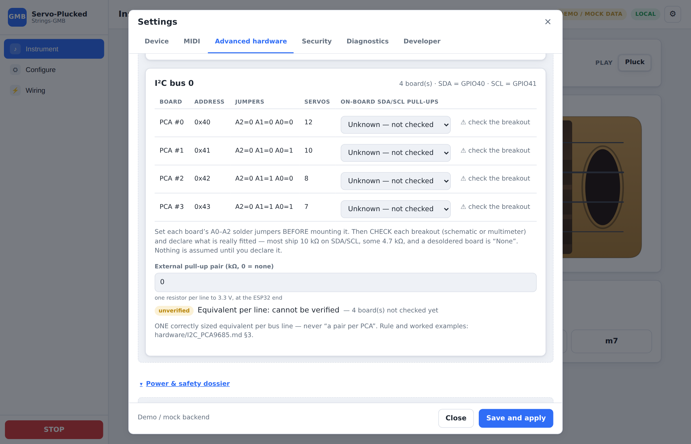
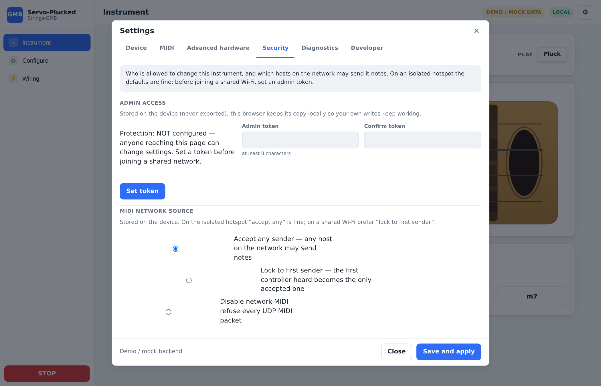
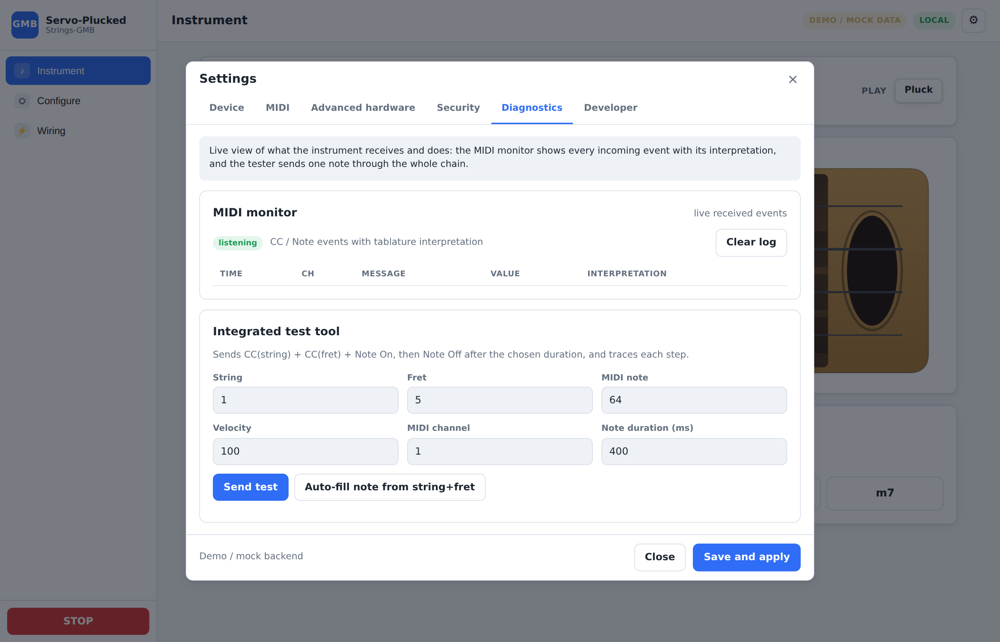

# Web Interface — Servo-Plucked-Strings-GMB

> Sources: `SPECIFICATION.md` §9, §10, §18, §19, §20 · `STRING_FRET_SELECTION.md` §14–16 · `SYSEX_CAPABILITIES.md` §17–18.
> Related documents: [`ARCHITECTURE.md`](ARCHITECTURE.md) · [`PIN_CONFIGURATION.md`](PIN_CONFIGURATION.md) · [`MIDI_PROTOCOL.md`](MIDI_PROTOCOL.md) · [`FIRST_CONFIGURATION.md`](FIRST_CONFIGURATION.md).

The Web interface lets a beginner configure the instrument without modifying the
source code, from a computer, a tablet or a phone. No dedicated application is
required.

---

## 1. The rule the interface follows

> **A creation screen only shows the decisions the software cannot take itself.
> Anything that can be derived, generated or safely defaulted stays hidden until
> the user asks to change it.**

There is no global *Simple / Expert* switch. Progressive disclosure is **local**:
each screen shows the few things that matter and carries its own *Advanced…*
disclosure for the rest. Nothing is removed — every expert control that ever
existed is still reachable — but it is reachable **on purpose**, not in the way.

Concretely, the user answers questions about their **machine**:

* how many strings, tuned how, with how many frets;
* how the frets are actuated (one servo per fret · one servo for two frets ·
  open strings only · custom);
* how the string is played (single pick · back-and-forth pick · strum);
* how the string is stopped (let it ring · the plectrum · a damper · a descent servo).

…and the software answers with the **machine**: every servo, its role, its
PCA9685 board, its I²C bus and its channel, the GPIO map, the timing, the
servo-start governor and the MIDI mapping. The user never types a channel number
to get a working instrument.

The servo's mechanical **pulse window** (`pulseMinUs`/`pulseMaxUs`) is never
surfaced — angles are converted against it.

---

## 2. Navigation

Three main pages, plus a gear menu:

| Entry | What it is for |
| ----- | -------------- |
| **Instrument** | play it and see its state |
| **Configure** | design it, calibrate it, test it, apply it |
| **Wiring** | the generated harness diagram + the commissioning checklist |
| **⚙ Settings** | device & Wi-Fi · MIDI · advanced hardware · security · diagnostics · developer |

GPIO assignment, I²C addressing, pull-up sizing, the power dossier, the timing and
the servo-start governor are **not** navigation entries: they are integration and
diagnostic tools, and they live in ⚙ → **Advanced hardware**. SysEx never appears
in front of somebody who only wants to build a guitar — it is in ⚙ → **Developer**.

### 2.1 First run

On a device that has never been configured from this browser, the interface opens
on a **Welcome** screen rather than on an empty fretboard:

<p align="center"></p>

*Use a template* picks an instrument family and drops the user straight into the
designer; *Create a custom instrument* goes there directly. Once a configuration
has been applied, **Instrument** becomes the home page and the welcome screen
never returns (⚙ → Device → *Re-run the welcome screen* brings it back).

---

## 3. Configure — the five steps

The whole creation of an instrument is one ordered flow: **Instrument → Frets →
Strings → Test → Finish**. MIDI, timing and the power governor are *not* steps:
they have recommended values the firmware applies on its own.

A **configuration health bar** sits above every step — `🟢 No error` /
`🟡 N recommendations` / `🔴 N errors` — and clicking it jumps to the final check.
The user always knows whether what they are building is currently valid.

| Step | Content |
| ---- | ------- |
| 1 **Instrument** | preset + name; strings & tuning (count 1–6, per-string open note + max fret); the **three mechanical questions**; then *Your instrument* — a live count of what was generated (strings, finger servos, plectrums, dampers, PCA9685 boards needed) and one summary line each for the controller, the wiring, MIDI and the timing, each with its own *Change* |
| 2 **Frets** | the finger servos, one string at a time. A clickable coverage strip shows which frets carry a servo (geared marked ⚙); tap a fret to calibrate **rest** and **press** with − / + steppers, test it, and step to the next fret. Wiring is a one-line summary; gearing, travel/settle and removal are behind *Advanced* |
| 3 **Strings** | the plectrum: **rest position**, **end of stroke** (and the return stroke when alternating), a test row, the **movement** chips (single / back and forth / strum) and *The plectrum moves the wrong way? [Invert]*. Then **Extras** — `+ Add a damper` / `+ Add a descent servo`, each unfolding its own calibration only once fitted — and **Stopping the note**, which states the chosen policy and shows only the angle it needs |
| 4 **Test** | one big **Test the instrument automatically** button (fingers → plectrums → open strings → a few real notes), the validity/armed checks above it, and *Individual tests…* for the group and per-string tests |
| 5 **Finish** | the check in plain language with *Fix automatically* where the software can repair it, the generated wiring recap, **Save and apply**, and the commissioning call-to-action |

### 3.1 Instrument — the designer

<p align="center"></p>

Each mechanical card carries the **servo count it implies**, so the trade-off is
visible before committing: *One servo per fret — 37 servos* against *One servo for
two frets — 33 servos*. Choosing a card regenerates the wiring immediately and
**differentially**: every servo whose mechanical identity survives keeps its full
calibration and wiring, only genuinely new actuators get defaults.

When the strings do not all share the same mechanism (a hand-edited profile, or a
per-string change made later), the card shows *mixed* rather than pretending one
option is selected — and picking one applies it to every string.

*Advanced options* holds the link to the advanced-hardware settings and a
**Danger zone** with the only destructive action in the flow (*Reset wiring &
calibration to defaults*), which used to sit at the same level as the ordinary
controls.

### 3.2 Frets

<p align="center"></p>

A fret editor now opens on the two positions the builder has to find with their own
eyes — **rest** and **press** — a **Test**, the note, and **Next fret →**. The PCA
board, I²C bus and channel are one line (`Wiring · PCA #2 · CH7 ✓ [Change…]`) which
expands into the full source editor on demand.

**Geared (paired) fingers.** The 2-fret gearing is an *Advanced* per-fret toggle
(the instrument-wide choice is on step 1). A geared servo shows **both press
angles**; the rest sits at their midpoint automatically (both fingers lifted), and
the paired fret's row says *"paired with fret N on one geared servo"*. Full study
and calibration procedure: [`GEARED_FINGERS.md`](GEARED_FINGERS.md).

### 3.3 Strings

<p align="center"></p>

This was the densest screen of the interface: it opened with the wiring and then
showed up to twenty-three fields — strokes, alternation, travel, settle, stroke
duration, minimum strike depth, mute source, mute hold, mute angle, descent servo
with its engagement mode, damper — whether or not the instrument had any of those
mechanisms. Now a mechanism that is not fitted costs exactly one line
(`+ Add a damper`), and `travelMs` / `settleMs` / `strokeMs` / `minStrikePct` /
`muteHoldMs` live under *Movement settings*.

### 3.4 Test

<p align="center"></p>

The automatic run exercises the whole instrument in the order a builder would check
it by hand, and says so. The per-string quick play now offers **the middle fret
that is actually equipped** on that string — the old screen hard-coded *Fret 5*,
which a `maxFret = 3` string cannot play.

### 3.5 Finish

<p align="center"></p>

Validator issues are rendered as *who / what / how to fix*:

```text
✖ String 3 — fret 6                                    [ Fix automatically ]
  Two actuators are wired to the same PCA9685 output, or the channel is out of
  range — this one has no usable output.
  ▸ Technical details   servos[17] (finger, PCA 2/CH7) — PCA bus/board/channel 0:2:7 used twice
```

*Fix automatically* moves the servo to the first free output (or gives a direct
servo a free GPIO, or wires the missing SDA/SCL/`SERVO_OE` from the board profile,
or adds the missing plectrum). The raw field path stays available, one click away.
The firmware `ProfileValidator` remains authoritative: no actuator is driven until
the critical errors are fixed.

**Save and apply** replaces the old *Save & publish*; the confirmation is
`Configuration applied ✓`. Revision numbers, profile slots and published
capabilities are firmware vocabulary and no longer appear in the normal path.
**Discard** asks for confirmation before throwing work away.

Once the configuration has been applied, the step ends on the **commissioning
call-to-action** — the staged power-up must happen before the whole rig gets
current.

### 3.6 Testing one servo or a group

The Frets, Strings and Test steps each carry an **Arm** control and a **test
bench**: single-servo buttons, plus group tests (sweep every fret of a string or
all strings, pluck every open string, sweep every plectrum, damper or descent
servo, test everything) run through a cancellable client-side sequencer with a live
status line and a **Stop** button. On the calibration steps the group bench is
folded under *Group tests…*; on the Test step the automatic run is the headline.

---

## 4. Wiring — generated, not configured

<p align="center"></p>

The project already knows every servo, board, bus and channel, so this page's job
is to **show the result** and to walk the first power-up. Two sub-tabs:

**Diagram** — the adaptive ESP32 + PCA9685 harness map: one or two I²C buses,
boards at their address, per-pin string·role, live conflict checks (a missing `/OE`
is an **error** — the profile cannot arm — and a missing hardware E-stop
declaration is flagged), SVG export — plus a **Power wiring** card: run a **direct
line from the supply to each PCA9685** (star wiring, no daisy-chaining, fused per
branch), add a **bulk capacitor** at each board's V+/GND sized to how many
micro-servos start at once (**~4 → 1000–2200 µF**, **~8 → 2200–4700 µF**,
**~16 → 4700–10000 µF** — empirical micro-servo starting values; size from datasheet
peaks with C ≈ I·Δt/ΔV and confirm at the bench) with a **100 nF ceramic** in
parallel to filter HF noise (limits ESP32 crashes on a shared supply), and make
`/OE` **fail-safe** (pull-up + E-stop chain — `hardware/POWER_AND_SAFETY.md`). A
per-board table sizes the caps from each board's worst-case simultaneous starts
(which the governor's per-board cap bounds).

**Commissioning** — the staged power-up checklist of `hardware/COMMISSIONING.md`
(stage gates, E-stop tests, per-branch bring-up) with per-instrument progress kept
in the browser. Each stage is a real **gate**: its boxes stay **disabled** (*blocked
by the previous gate*) until every box of the stage before it is ticked — a
deliberate out-of-order check needs the explicit *Unlock this stage anyway* button.
<p align="center"></p>

---

## 5. ⚙ Settings

Six tabs, split by **who needs them** rather than by which firmware subsystem owns
them. The modal is a real dialog: `role="dialog"`, `aria-modal`, a focus trap, and
focus restored to the gear button on close.

### 5.1 Device

<p align="center"></p>

First view: **where the device is connected** and **how to reach it if that fails**
— the current network, the `.local` name, and a *Change network* button that opens
the scanner. The hotspot section has the fallback SSID and *Start the hotspot now*.

*Advanced network options* holds the mode selector, the hotspot SSID, the hostname
and the credential erasure (*Forget the stored Wi-Fi password*, *Remove the hotspot
password*). Network settings are **device state**: saving stores them in NVS
(independently of any profile slot, so they survive reboots and profile changes) and
applies them immediately, with the automatic hotspot fallback if the connection
fails. Picking an open network needs no password; "Forget" really erases the stored
secret (a blank field keeps it). See [`NETWORK_HOTSPOT.md`](NETWORK_HOTSPOT.md).

### 5.2 MIDI

<p align="center"></p>

Opens on a verdict, not on a form:

```text
Automatic — the instrument listens on every channel, maps notes to strings itself
and understands General-Midi-Boop tablature.
```

*MIDI parameters* unfolds channel, Omni, velocity curve, transpose, chord window,
sustain pedal + its CC and the chord **saturation strategy**. *String / fret
selection* unfolds the tablature toggle, the General-Midi-Boop preset button and the
CC-level settings (CC numbers, numbering, order, missing-CC policy). *Selection
internals* unfolds the offsets, ranges, policies and the string-order mapping table.
When any of it differs from the automatic setup the header says so and offers
*Back to automatic*.

**MIDI channels are 1–16 everywhere on screen.** The firmware stores the channel
zero-based; the interface subtracts one in its data layer and never tells the user.
(The old panel was labelled *Global channel (1–16)* over an input that accepted
0–15, with a hint explaining the storage.)

### 5.3 Advanced hardware

<p align="center"></p>

Everything the generator normally decides:

* **Controller board** — the ESP32 board selector (S3-DevKitC-1 v1.0 / v1.1,
  WROOM-32, DevKit v1 — the two S3 revisions are separate boards, their RGB-LED pin
  differs) and the native-USB reservation. Step 1 shows it as
  `Controller · ESP32-S3-DevKitC-1 ✓ [Change]`.
* **PCA9685 boards & I²C** — the channel-capacity meter and the second-bus split
  (assign each physical board to bus 0 or bus 1, auto-split evenly, separate `/OE`
  per bus).
* **Responsiveness** — three presets (*Fast* · *Balanced*, recommended ·
  *Limited power supply*) covering the action delay, the fret → strum delay and the
  servo-start governor. *Exact values* unfolds every number, with a recommendation
  computed from the actual servo/board count and a *Use the recommended limit* button.
* **GPIO pins** — the board GPIO map + per-signal assignment with a graphical board
  pinout, the auto-assign and validate buttons, and the **Emergency stop input**
  card: declare the hardware E-stop, pick its contact wiring (**normally closed
  recommended** — a press, a cut wire or an unplugged connector all read as STOP) and
  its `ESTOP` GPIO.
  <p align="center"></p>
* **I²C addressing & pull-ups** — per bus: SDA/SCL pins, every board with its address
  and **A0–A2 solder-jumper setting**, and the **pull-up budget**. Each board starts as
  **unknown — not checked**: the page never assumes what a breakout carries, so the bus
  reads *"equivalent per line: cannot be verified"* until you have looked at each board
  and declared what is fitted (a value, or *none/removed*), plus an optional external
  pair. With everything declared it computes the **equivalent per line** (parallel
  resistors add) and grades it against the target window (one equivalent 2.2–4.7 kΩ per
  bus line — `hardware/I2C_PCA9685.md` §3).
  <p align="center"></p>
* **Power & safety dossier** — the reference circuit of `hardware/POWER_AND_SAFETY.md`
  applied live to the instrument: a **Safety chain** card mixing derived facts (`/OE`
  GPIO, hardware E-stop + contact wiring) with the **fitted-on-the-machine
  declarations** (`/OE` pull-up, gated enable stage, E-stop contactor, master switch,
  main + branch fuses — stored in the profile's `hardware` block, documentation-only); a
  **power tree** SVG (PSU → main fuse → master switch → E-stop contactor → star
  distribution → fused branch + bulk cap per PCA → `/OE` bus and E-stop contacts) where
  **undeclared elements draw dashed**; and a **Current & supply estimator** built on
  fleet-typical idle/moving/stall currents. It reports **two figures per branch**: the
  *governed peak* (what normal play and the governed arming park draw, under the
  Responsiveness caps) and the *absolute peak* (every servo of the branch at stall). The
  governor is software, so the **wiring and the PSU are sized on the absolute figure**
  and the fuse sits comfortably above the governed one and at/below the wiring's
  ampacity; the bulk-cap suggestion (C ≈ I·Δt/ΔV, editable Δt/ΔV) follows the governed
  starts, and the wire voltage-drop check runs on the absolute peak. The direct-GPIO
  rail is only bounded by the global cap, matching the runtime.
  <p align="center"></p>

### 5.4 Security

<p align="center"></p>

The admin-token workflow (set / unlock this browser, with a banner when no token
protects the device) and the **MIDI network source** posture (accept any sender ·
lock to the first sender · disable network MIDI).

### 5.5 Diagnostics

<p align="center"></p>

The live **MIDI monitor** and the **integrated test tool**.

**Web MIDI monitor (§15)** — real time:

| Time | Channel | Message | Value | Interpretation |
| ----: | ----: | ------- | -----: | -------------- |
| 0 ms | 1 | CC20 | 3 | string 3 |
| 1 ms | 1 | CC21 | 5 | fret 5 |
| 2 ms | 1 | Note On 60 | 100 | string 3, fret 5 |

Also displays: complete / pending / expired selection, invalid value, automatic
allocation used, note/fret mismatch, actual physical string. A button to clear
the log.

**Built-in test tool (§16)** — choose string, fret, MIDI note, velocity and MIDI
channel (1–16); automatically sends string CC → fret CC → Note On → Note Off after a
chosen duration, and displays each step (CC received, selection validated, finger
pressed, string plucked).

### 5.6 Developer

<p align="center"></p>

**Identity (§17.1)**: enabling GMB detection, instrument name, type, GM program,
MIDI channel, the **Publish capabilities** and **Test communication** buttons, and
the status of the last detection. Computed capabilities, read-only:

```text
Strings: 4 · Frets: 12 · MIDI range: C4 – G5 (60–79) · Note mode: continuous
Polyphony: 4 (auto) · CC string: 20 · CC fret: 21 · Tuning: G4 C4 E4 A4 · Revision: 7
```

**Advanced GMB options (§17.2)**: enabling blocks 5/6/7, the block 7 version
(v1 compatible / v2 extended), the polyphony override, the list of announced CCs,
plus **View raw SysEx bytes** and **Send change notification (block 0x11)**. There
is no "regenerate device id": the v2 `instance_id` is derived from the ESP32 MAC and
is stable by design.

**SysEx tester (§18)**: **GMB descriptor (v2)** · **Request identity (v2 handshake)**
· **Notify change** · **Request capabilities (v1)** · **Request string config (v1)** ·
**Full discovery**. For each test: message sent, message received, decoding of fields,
7-bit validity, length, possible error, response time. Protocol details in
[`MIDI_PROTOCOL.md`](MIDI_PROTOCOL.md) §3.

Profiles are intentionally not exposed (a hidden, non-user setting).

---

## 6. Errors, messages and accessibility

**Errors persist, confirmations pass.** A rejected save is not a toast that vanishes
after three seconds: it opens a **persistent alert** under the top bar, with the
reasons listed and the raw field paths under *Technical details*, and it stays until
dismissed. Toasts are kept for transient confirmations.

**Accessibility.**

* every interactive control — buttons, nav items, steps, sub-tabs, settings tabs,
  string tabs, fret chips, presets, mechanical cards, chord buttons, disclosures —
  has a visible `:focus-visible` ring;
* the gear button and the hamburger carry an `aria-label`, the hamburger also
  `aria-expanded`, the nav items `aria-current`;
* the Settings modal is `role="dialog"` + `aria-modal="true"`, traps Tab, closes on
  Escape and restores focus to the gear button;
* the toast host is an `aria-live="polite"` status region; error toasts and the
  persistent alert are `role="alert"`;
* steppers, sub-tabs and tab strips expose `role="tablist"` / `role="tab"` /
  `aria-selected`; the movement chips expose `aria-pressed`;
* `prefers-reduced-motion: reduce` disables the pulsing badge, the sliding
  toasts/panels and the vibrating strings;
* touch targets: the fret chips went from 30 px to 44 px, and the angle steppers,
  string tabs and sub-tabs are at least 42–44 px.

---

## 7. Status surfaced in the UI (§19)

There is **no separate dashboard page**. The state a player needs is folded into the
top of the **Instrument** page and into every step that drives hardware:

```text
STOP (panic) · Re-arm servos · Armed / Not armed badge · play mode
+ a DEMO / MOCK DATA badge and the connection badge in the top bar
```

The Frets / Strings / Test steps repeat the same **Arm** control and armed badge,
plus a live status line for the running test sequence. The Configure page adds the
permanent configuration health bar.

The **full per-string dashboard of §19** (per-string state machine, current note and
fret, finger up/down, plectrum strike/rest, last fault, notes playing, active faults)
is **not** rendered as a page: the data is published by `GET /api/status` and
`WS /ws/status`, and is read by the UI only to decide *armed / not armed*. There is no
carriage position, HOME/LIMIT or temperature/voltage readout — the servo-per-fret
firmware emits none.

---

## 8. Instrument — the playable neck

<p align="center"></p>

Once the instrument is defined and calibrated, the **Instrument** page (the sidebar's
first entry, and the landing page after the first successful apply) turns it into a
clickable **keyboard**. It draws the neck as a stylised instrument (headstock +
tuning pegs, wood fretboard, body with a soundhole) with the strings and fret wires
laid out **to scale** — the fret spacing follows equal temperament
(`d(n) = 1 − 2^(−n/12)`, the *rule of 18*), so the neck compresses toward the body
like a real fretboard.

```text
open note ─┐        fret 1   2    3     …          soundhole
 (nut)     │  [f1]  [f2]  [f3] …  ← finger-servo pads, just before each wire
  G4 ●═════╪════●═════●═════●══════════════════════════  ← string (lights up when played)
```

* **Servos as pads** — each equipped fret shows its finger servo as a rectangle on the
  string, just on the nut side of the fret wire; a **geared** finger shows a dashed pad
  on both of its frets; frets with no servo are inert.
* **Press-and-hold to play** — pressing a fret with a servo drives its **finger servo**
  to the calibrated contact pulse and **sounds the string** (the played string changes
  colour); **releasing** lifts the finger. The zone left of the nut plays the **open
  string** (fret 0). One finger per string at a time; multi-touch plays chords.
* **Play mode** — only the mechanically-feasible options are offered: **Pluck** always,
  **Up-stroke** / **Alternate** for a *strum* servo, **Muted** when a *damper* exists.
  A *strum lift* is lowered for the stroke and raised again.
* **Chord bar** — pick a root (C … B) and a type (Maj / Min / 5 / 7 / Maj7 / m7): on
  each string the lowest reachable fret of the chord is pressed and the strings are
  struck together.
* Uses the same `POST /api/test/servo` path as the setup flow (works on the device
  **once armed** — a **Re-arm servos** button and an armed badge sit next to the STOP —
  and stand-alone against the mock). Reads the **draft** profile, so an in-progress
  calibration is playable immediately. Leaving the page lifts any held finger, and the
  **STOP (panic)** button (top bar and sidebar) is the safety net.

The step-by-step first-configuration walkthrough is in
[`FIRST_CONFIGURATION.md`](FIRST_CONFIGURATION.md); the per-fret contact-angle
procedure is in [`CALIBRATION.md`](CALIBRATION.md).

---

## 9. Profiles (§20)

Up to **8 profile slots** — create, copy, rename, delete, export, import, restore, set
the startup slot. `profiles.js` implements the whole view and the REST routes below
are live, but **no page mounts it**: profile management is deliberately hidden from
the UI. The instrument is saved with **Save and apply**, which activates it and
publishes the capabilities. The slots stay reachable through the API.

**JSON** exchange format:

```json
{
  "project": "Servo-Plucked-Strings-GMB",
  "profileVersion": 1,
  "capabilitiesRevision": 1,
  "instrument": { "name": "Ukulele GCEA", "stringCount": 4, "type": "ukulele" },
  "board": { "profile": "esp32-s3-devkitc-1", "reserveUsb": true },
  "network": { "mode": "accessPoint", "apSsid": "Servo-Plucked-Strings-GMB", "hostname": "gmb-ukulele" },
  "power": { "maxConcurrentMoves": 3, "maxConcurrentPerBoard": 0, "staggerMs": 8 },
  "strings": [ { "enabled": true, "openNote": 67, "maxFret": 12 } ],
  "servos": [
    { "function": "finger", "stringIndex": 0, "fret": 1,
      "source": "pca", "pcaBoard": 0, "channel": 0, "restUs": 1000, "activeUs": 1800 }
  ]
}
```

The Wi-Fi password **never** appears in ordinary exports (unless an explicit
option is set).

**Velocity** acts on the plectrum attack depth between `restUs` and `activeUs`.

---

## 10. REST / WebSocket API (`platform/esp32/WebApi.cpp`)

> Implemented by the Web layer (`platform/esp32/WebApi.cpp`). The static UI is served
> from the **copy embedded in the firmware binary** (`WebAssets.cpp`); a LittleFS
> `/www` file, when present, overrides it per file. It exposes the `Profile` /
> `PinManager` / `SafetyManager` / `GmbSysEx` core described in
> [`ARCHITECTURE.md`](ARCHITECTURE.md).

### 10.1 REST endpoints

| Method | Endpoint | Role |
| ------- | -------- | ---- |
| `GET` | `/api/status` | overall status + per string (dashboard §19) |
| `GET` | `/api/commands?id=N` | poll the outcome of a `202`-accepted command (queued / succeeded / refused / unknown) |
| `GET` | `/api/capabilities` | current capabilities snapshot (read-only) |
| `GET` | `/api/board/{id}` | board profile + GPIO capabilities (colors, filtering) |
| `POST` | `/api/pins/auto` | auto-assign the board pins (SDA / SCL / SERVO_OE) for the draft |
| `POST` | `/api/pins/validate` | validate the full profile → list of issues |
| `GET` | `/api/profile` | active profile (JSON) |
| `PUT` | `/api/profile` | replace the profile (draft → validation → activation) |
| `GET` | `/api/profiles` | list of saved profile slots |
| `POST` | `/api/profiles` | save the profile to a numbered slot (`{slot, profile, startup}`) |
| `POST` | `/api/profiles/load` | activate a stored slot |
| `POST` | `/api/profiles/read` | read a slot **without** activating it (copy / rename / set-startup) |
| `POST` | `/api/profiles/delete` | delete a slot |
| `POST` | `/api/reset` | recover from panic / E-stop and re-arm |
| `POST` | `/api/panic` | software panic (`SafetyManager::panic`) |
| `POST` | `/api/test/note` | play a test note (channel, note, velocity, durationMs); armed only |
| `POST` | `/api/test/servo` | drive a servo to rest/active, or to an exact `us` pulse and hold it (live calibration, incl. a geared finger's side B); armed only |
| `POST` | `/api/hotspot` | switch to the access point + captive portal now (see [`NETWORK_HOTSPOT.md`](NETWORK_HOTSPOT.md)) |
| `POST` | `/api/wifi` | store device network settings (mode/SSID/hostname) + write-only credentials in NVS; `apply:true` reconnects now, `clearStationPassword` erases the stored secret |
| `GET` | `/api/wifi/scan` | latest Wi-Fi survey `{scanning, networks:[{ssid,rssi,secure,channel}]}`; `?start=1` kicks a fresh scan |
| `POST` | `/api/midi/source` | UDP MIDI source posture: `{policy: "open"\|"lockToFirst"\|"disabled", unlock: bool}` — stored device-side (NVS), applied live |
| `POST` | `/api/auth` | set the admin token (first-run bootstrap allowed) |
| `POST` | `/api/auth/check` | test a candidate admin token (200 = right, 401 = wrong); never changes the stored one |
| `POST` | `/api/storage/format` | deliberate LittleFS reformat |
| `POST` | `/api/sysex/request` | run a GMB SysEx buffer → decoded response |
| `GET` | `/api/diagnostics` | runtime telemetry snapshot (§4.3) |
| `GET` | `/gmb/descriptor.json` | GMB v2 descriptor served to a General-Midi-Boop controller |

There are **no** stepper `jog` / `endstop` routes: servo-per-fret has no carriage
or HOME/LIMIT sensors. Per-fret finger calibration uses `POST /api/test/servo`.

### 10.2 WebSocket

| Channel | Role |
| ----- | ---- |
| `WS /ws/midi` | inbound/outbound MIDI stream (MIDI monitor §15) |
| `WS /ws/status` | real-time dashboard and per-string status (§19) |

Notes:

* `PUT /api/profile` follows the draft → `ProfileValidator` → atomic save →
  `capabilitiesRevision` increment → snapshot rebuild → Block 8 notification flow
  (see [`MIDI_PROTOCOL.md`](MIDI_PROTOCOL.md) §3.7). A draft configuration is
  **never** published.
* `POST /api/pins/auto` and `/api/pins/validate` map directly to
  `PinManager::autoAssign` / `validate` (see [`PIN_CONFIGURATION.md`](PIN_CONFIGURATION.md)).
* `POST /api/panic` and the safety state: see [`SAFETY.md`](SAFETY.md).

### 10.3 Diagnostics — `GET /api/diagnostics` (P2.19)

Runtime telemetry for a future physical bench (JSON). Read-only, no auth. The body
is built on the loop side and read as a snapshot by the web task (it never touches
live I2C or state). Fields:

| Champ | Sens |
| ----- | ---- |
| `uptimeMs` / `resetReason` | temps depuis boot / cause du dernier reset |
| `freeHeap` / `minFreeHeap` | tas libre courant / minimum observé |
| `state` | état applicatif (`configSafe`/`parking`/`ready`/…) |
| `midi.events` / `droppedEvents` / `droppedPackets` | événements MIDI ingérés / perdus (overflow) / datagrammes perdus |
| `scheduler.maxLatencyUs` / `jitterUs` / `meanUs` | pire période `loop()`, pire écart, moyenne lissée |
| `cmdQueueHighWater` | profondeur max de la file web→loop |
| `faults` / `servoMoves` / `governorThrottles` / `wifiReconnects` | compteurs cumulés |
| `moveMix.deadline` / `staggerableGranted` / `staggerableDeferred` | répartition des mouvements vue par l'ActuatorManager (frappes sonores jamais throttlées ; positionnements accordés / différés) — P1.6 |
| `pca.used` / `healthy` / `failedBoard` | santé PCA9685 (carte défaillante nommée `bus N / 0x4A`) |

Métriques non encore instrumentées (à ajouter progressivement) : latence par corde,
compteurs par transport MIDI (voir l'abstraction transports, P1.7).
