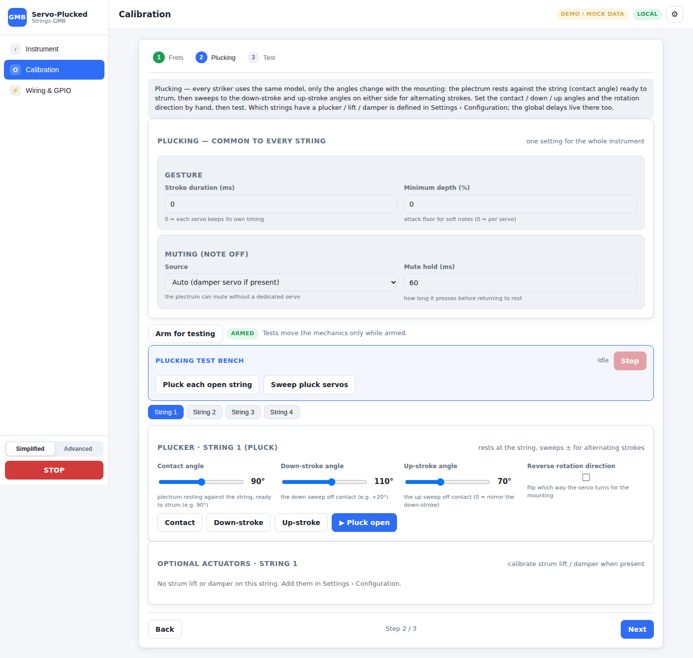
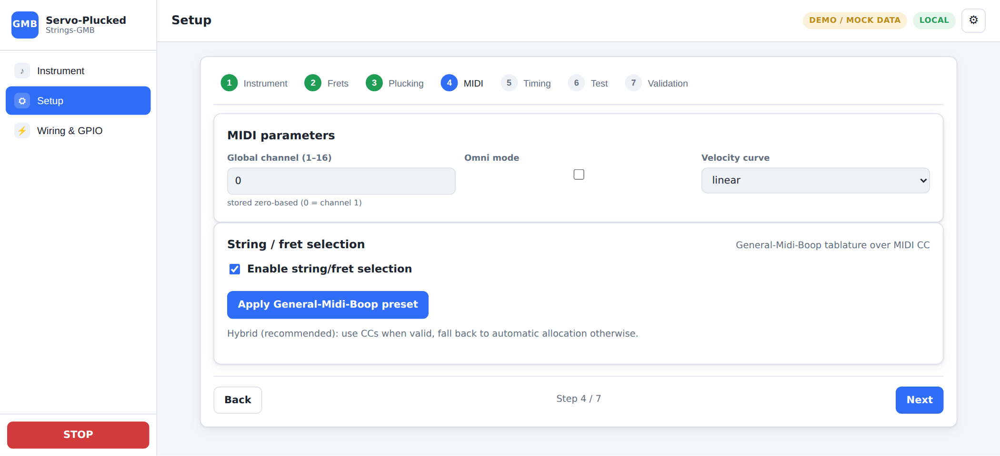
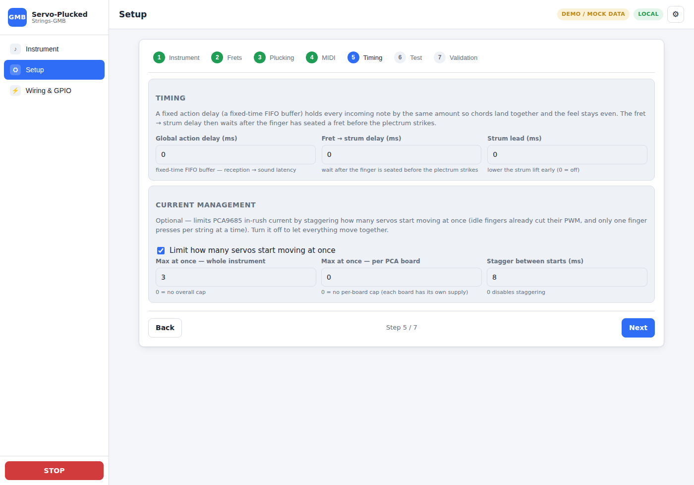
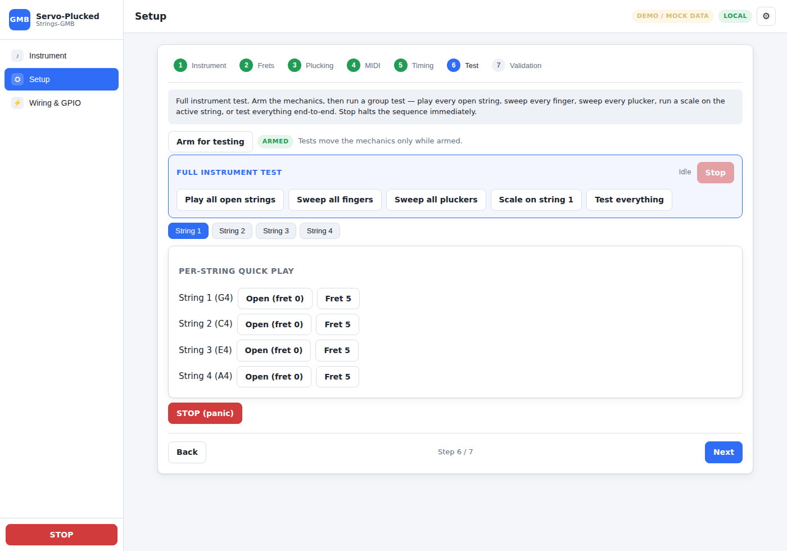
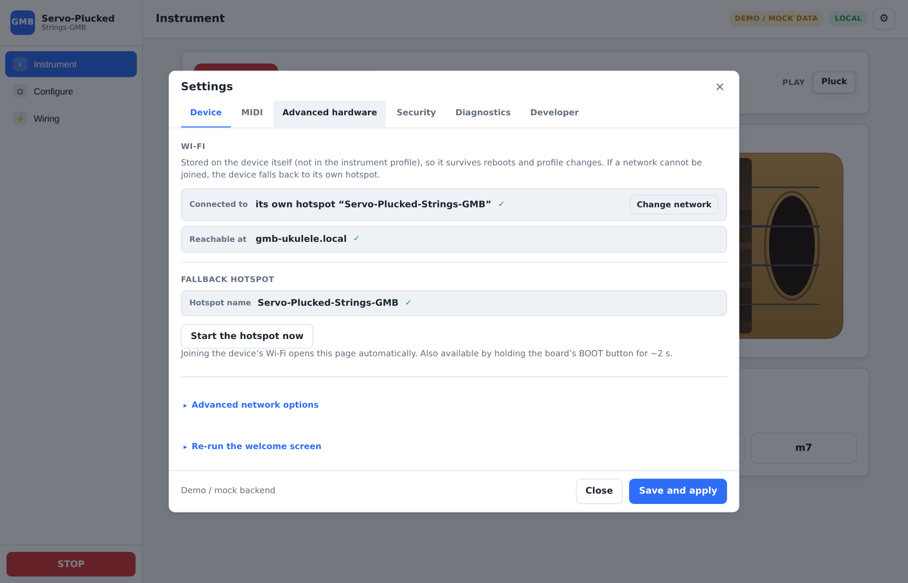
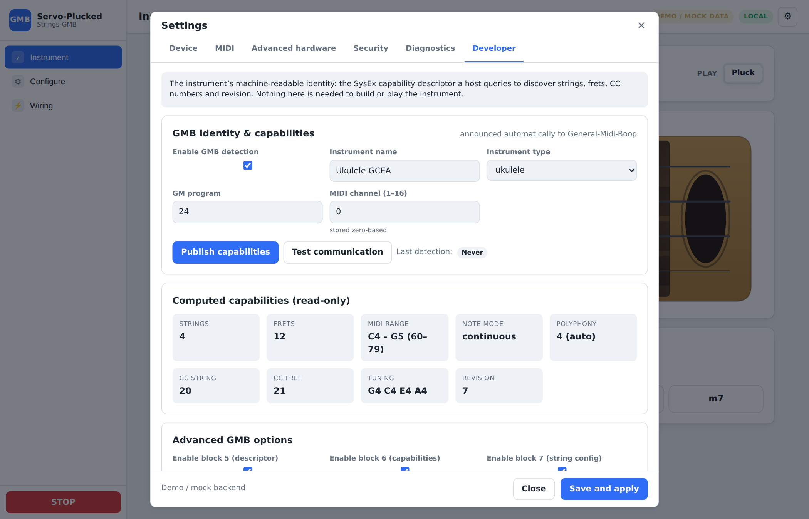

# Web Interface — Servo-Plucked-Strings-GMB

> Sources: `SPECIFICATION.md` §9, §10, §18, §19, §20 · `STRING_FRET_SELECTION.md` §14–16 · `SYSEX_CAPABILITIES.md` §17–18.
> Related documents: [`ARCHITECTURE.md`](ARCHITECTURE.md) · [`PIN_CONFIGURATION.md`](PIN_CONFIGURATION.md) · [`MIDI_PROTOCOL.md`](MIDI_PROTOCOL.md) · [`FIRST_CONFIGURATION.md`](FIRST_CONFIGURATION.md).

The Web interface lets a beginner configure the instrument without modifying the
source code, from a computer, a tablet or a phone. No dedicated application is
required.

---

## 1. One simplified interface

The interface is deliberately **simplified-only** — there is no expert / advanced
toggle. A step-by-step wizard with recommended values, automatic pin assignment,
wiring diagrams, test buttons, automatic validation and understandable error
messages. It shows only the **green** GPIOs (see
[`PIN_CONFIGURATION.md`](PIN_CONFIGURATION.md)) and keeps each step to the few
choices that matter: per-servo you set the **PCA board + pin** and the **angle(s)**
right where you calibrate; the fine timing (pulse window, travel/settle) uses sane
defaults and is not surfaced.

---

## 2. Setup — the complete instrument flow (7 steps, §10)

The **whole creation of an instrument is one ordered flow on the Setup page** (no
setting is split between a page and a modal): define it, calibrate what you defined,
set its MIDI behaviour and timing, test it and save. Only device Wi-Fi and the
diagnostic tools live in the gear modal.

| Step | Title | Content |
| ----- | ----- | ------- |
| 1 | **Instrument** | Pick a **preset** (ukulele/guitar/bass/mandolin/banjo/custom — type is cosmetic), name it, set **strings & tuning** (count 1–6, per-string open note + max fret), and the **Board** — the **ESP32 board selector** (S3 / WROOM-32 / DevKit v1) + native-USB reserve. A preset produces a working instrument and the wiring is (re)generated automatically; the mechanics live per-servo on the Frets / Plucking steps |
| 2 | **Frets** | the **finger servos**, per string (string-tab strip). A clickable **coverage strip** shows which frets carry a servo (geared marked ⚙); **tap a fret** to open its **servo div** — a **"One servo drives 2 frets (geared)"** toggle, its **PCA board + pin**, the **angle(s)** set with precise **− / + steppers** (a geared servo shows both press angles; its rest sits at their midpoint automatically), and the **rotation direction**. Every change drives the servo live; **play the note** to check. An open-only string shows a one-click *Equip frets*. A **test bench** sweeps one string or all strings |
| 3 | **Plucking** | one **sounding servo** per string: its **PCA board + pin**, the **contact angle** (plectrum against the string) and the **strum angle** (how far it sweeps, e.g. 20°) — the servo **always alternates** its stroke, so there are no direction options. Plus the **second way to strum**: an optional **descent servo** that lowers the plectrum onto the string only while it plays (its own PCA/pin + raised / lowered angles). A **test bench** plucks every open string and sweeps the strum servos |
| 4 | **MIDI** | global channel, Omni, sustain pedal, velocity curve; a reminder that **CC20 selects the string** and **CC21 the fret** before a Note On. The live MIDI monitor + tester stay in the gear modal (Advanced) |
| 5 | **Timing** | two cards. **Timing** — the two global delays: the **action delay** (fixed-time FIFO buffer) and the **fret → strum delay**, plus the strum lead. **Current management** — an **optional** governor (a toggle turns it off): cap how many servos start moving at once **whole-instrument** and **per PCA board** (each 0 = no cap), plus the stagger between starts |
| 6 | **Test** | play an **open (fret 0)** note and a fretted note on each string (arm first); a full-instrument **test bench**; STOP (panic) |
| 7 | **Validation** | "No problems found" or a precise list of problems; the firmware `ProfileValidator` is authoritative and no actuator is driven until the critical errors are fixed |

**Board** selection lives in the **Instrument** step; **Network** (Wi-Fi) settings are
in the gear modal — they belong to the device, not the instrument. The **automatic
pin assignment** is a button on the **GPIO Pins** page; neither is a separate setup
step.

The per-string steps (**Frets** and **Plucking**) show **one string at a time** via
a string-tab strip, so a 6-string instrument stays navigable. Each servo carries its
own **PCA board + pin** and **angle(s)** right where you calibrate it; the fine timing
(pulse window, travel/settle) uses sane defaults and is not surfaced. General MIDI
parameters (sustain, chord **saturation strategy**, velocity curve…) live on the
**MIDI** step.

**Testing one servo or a group.** The Frets, Plucking and Test steps each carry an
**Arm** control and a **test bench**: single-servo buttons, plus group tests (sweep
every fret of a string or all strings, pluck every open string, sweep every strum
servo, test everything) run through a cancellable client-side sequencer with a live
status line and a **Stop** button.

The step-by-step detail is in [`FIRST_CONFIGURATION.md`](FIRST_CONFIGURATION.md).

**Geared (paired) fingers.** On the *Frets* step, a fret's servo div offers a
**"One servo drives 2 frets (geared)"** toggle: one servo then presses two antagonistic
frets through a gear (side A = `fret`, side B = `fretB`). The div shows **both press
angles** (one per fret); the **rest sits at their midpoint automatically** (both
fingers lifted). The paired fret's own row shows *"paired with fret N on one geared
servo"*. Full study and calibration procedure:
[`GEARED_FINGERS.md`](GEARED_FINGERS.md).

**Gear modal (device only).** A gear button (⚙) in the top bar opens the device
**Settings** modal — now just two tabs, since the whole instrument setup moved to the
Setup page: **Network** (mode / SSIDs / hostname, write-only Wi-Fi passwords, and a
**Start hotspot now** button) and **Advanced** (GMB identity & capabilities / SysEx
tester + the live MIDI monitor). Network and Wi-Fi changes are saved with the profile
and apply after a reboot; the hotspot button switches to the access point
immediately. See [`NETWORK_HOTSPOT.md`](NETWORK_HOTSPOT.md).
The per-fret contact-angle calibration on the Frets step is detailed in
[`CALIBRATION.md`](CALIBRATION.md).

---

## 3. Interface pages

### 3.0 The interface at a glance

Overview of the interface (standalone **demo data** — a 4-string GCEA ukulele).
All views are **adaptive**: they redraw from the active profile. The sidebar keeps
**three main pages**: the playable **Instrument**, the complete **Setup** flow (the
whole instrument creation in order), and the **Wiring & GPIO** reference. Only device
Wi-Fi and the diagnostic tools live in the gear modal (top-right).

#### Main page 1 — Instrument

A clean playable neck (GMB-style): a note-name circle on each equipped fret and the
open string, press-and-hold to play. A big emergency **STOP** + Re-arm and the
play-mode selector sit on top; a chord bar below strums common chords across the strings.
<p align="center"></p>

#### Main page 2 — Setup

The **whole instrument creation, in one ordered flow**: Instrument → Frets →
Plucking → MIDI → Timing → Test → Validation. Define the instrument, calibrate what
you defined, set its MIDI behaviour and timing, then test and save — nothing is split
across a page and a modal.

**Instrument** — minimal: pick a preset, name it, set the tuning, pick the ESP32
board; the servo wiring is (re)generated automatically (no mechanics to wade through):
<p align="center"></p>

**Frets** — tap a fret to open its servo div: the geared (2-fret) toggle, its PCA
board + pin, the angle(s) on precise − / + steppers, and the rotation direction (a
geared servo shows both press angles; its rest is their midpoint):
<p align="center"></p>

**Plucking** — one sounding servo per string: PCA board + pin, contact angle + strum
angle (always alternating), and an optional descent servo (the second way to strum):
<p align="center"></p>

**MIDI** — channel, omni, velocity, enable string/fret selection + GMB preset:
<p align="center"></p>

**Timing** — the two global delays (action delay / FIFO buffer, fret → strum delay, strum lead) + the **optional** PCA9685 in-rush governor (whole-instrument and per-board caps):
<p align="center"></p>

**Test** — full-instrument group tests: play every open string, sweep every finger / plucker, run a scale, test everything (Validation is the final step, then Save):
<p align="center"></p>

#### Main page 3 — Wiring & GPIO

Two sub-tabs. The adaptive ESP32 + PCA9685 harness map: one or two I²C buses, boards
at their address, per-pin string·role, live conflict checks, SVG export — plus a
**Power wiring** card: run a **direct line from the supply to each PCA9685** (star
wiring, no daisy-chaining), add a **bulk capacitor** at each board's V+/GND sized to
how many micro-servos start at once (**~4 → 1000–2200 µF**, **~8 → 2200–4700 µF**,
**~16 → 4700–10000 µF**) with a **100 nF ceramic** in parallel to filter HF noise
(limits ESP32 crashes on a shared supply). A per-board table sizes it from each
board's worst-case simultaneous starts (which the Timing step's per-board cap bounds).
<p align="center"></p>

…and the board GPIO map + per-signal assignment with a **graphical board pinout** that
highlights the used pins. The board itself is chosen on the Setup page (Instrument →
Board); this reference page shows it read-only and assigns pins on it.
<p align="center"></p>

#### Gear modal (device only)

**Network** — network mode, SSIDs, hostname, write-only Wi-Fi credentials and the hotspot switch:
<p align="center"></p>

**Advanced** — GMB identity & computed capabilities + the SysEx tester, and the live MIDI monitor:
<p align="center"></p>

Profiles are intentionally not exposed (a hidden, non-user setting).

### 3.1 Dashboard (§19)

Main page — overall status:

```text
overall state · Wi-Fi connection · MIDI source · active profile ·
strings-ready count · notes playing · active faults ·
capabilities revision · STOP button
```

Per string: status (state machine), open note, current note, current fret, finger
state (**up / down**), plectrum state (**strike / rest**), last fault. There is no
carriage position, HOME/LIMIT or temperature/voltage readout — the servo-per-fret
firmware emits none.

### 3.2 MIDI page — string/fret selection (STRING_FRET_SELECTION §14–16)

**Simplified** screen (§14):

```text
[✓] Enable string/fret selection
System used: [ General-Midi-Boop ]
String CC: [ 20 ]      Fret CC: [ 21 ]
String numbering: [ 1 to 6 ]
String order: [ Normal ]
When CC is absent: [ Choose automatically ]
```

Buttons: Apply preset · Test reception · Send a test · View received values. The
advanced settings (offsets, tables, policies) stay hidden under "Advanced
settings" (see [`MIDI_PROTOCOL.md`](MIDI_PROTOCOL.md) §2).

**Web MIDI monitor (§15)** — real time:

| Time | Channel | Message | Value | Interpretation |
| ----: | ----: | ------- | -----: | -------------- |
| 0 ms | 1 | CC20 | 3 | string 3 |
| 1 ms | 1 | CC21 | 5 | fret 5 |
| 2 ms | 1 | Note On 60 | 100 | string 3, fret 5 |

Also displays: complete / pending / expired selection, invalid value, automatic
allocation used, note/fret mismatch, actual physical string. A button to clear
the log.

**Built-in test tool (§16)** — choose string, fret, MIDI note, velocity,
channel; automatically sends string CC → fret CC → Note On → Note Off after a
chosen duration, and displays each step (CC received, selection validated, finger
pressed, string plucked).

### 3.3 MIDI page — GMB identity and capabilities (SysEx §17–18)

Path: `MIDI > GMB identity and capabilities`.

**Simplified mode (§17.1)**: enabling GMB detection, name, type, instrument
preset, GM program, MIDI channel, "Publish capabilities" and "Test
communication" buttons, status of the last detection. Computed capabilities,
read-only:

```text
Strings: 4 · Frets: 12 · MIDI range: 40 to 76 · Polyphony: 4
String CC: 20 · Fret CC: 21 · Tuning: E2 A2 D3 G3 · Revision: 7
```

**Advanced mode (§17.2)**: enabling blocks 5/6/7, choice of the block 7 version,
polyphony override, continuous range or discrete notes, viewing the announced CCs
and the SysEx bytes, manual sending of each response, sending the notification,
resetting the identifier, exporting the snapshot.

**SysEx tester (§18)**: simulate "Request identity / descriptor / capabilities /
string configuration / Notify a change / Full discovery". For each test: message
sent, message received, decoding of fields, 7-bit validity, length, possible
error, response time. Protocol details in
[`MIDI_PROTOCOL.md`](MIDI_PROTOCOL.md) §3.

### 3.4 MIDI settings (§18)

Global channel, Omni mode, per-string channel, general/per-string transposition,
note range, velocity curve (linear / soft / hard / exponential / custom), Note
Off behavior, sustain pedal, chord grouping delay (default 3 ms), saturation
strategy (see `NoteAllocator`, [`ARCHITECTURE.md`](ARCHITECTURE.md)). Velocity can
act on the plectrum travel/speed, the attack delay, the plucking profile.

### 3.5 Profiles (§20)

Up to **8 profile slots**. Functions: create, copy, rename, delete, export, import,
restore, set the startup slot. **JSON** exchange format:

```json
{
  "project": "Servo-Plucked-Strings-GMB",
  "profileVersion": 1,
  "capabilitiesRevision": 1,
  "instrument": { "name": "Ukulele GCEA", "stringCount": 4, "type": "ukulele" },
  "board": { "profile": "esp32-s3-devkitc-1", "reserveUsb": true },
  "network": { "mode": "accessPoint", "apSsid": "Servo-Plucked-Strings-GMB", "hostname": "gmb-ukulele" },
  "power": { "maxConcurrentMoves": 3, "maxConcurrentPerBoard": 0, "staggerMs": 8 },
  "strings": [ { "enabled": true, "openNote": 67, "maxFret": 12 } ],
  "servos": [
    { "function": "finger", "stringIndex": 0, "fret": 1,
      "source": "pca", "pcaBoard": 0, "channel": 0, "restUs": 1000, "activeUs": 1800 }
  ]
}
```

The Wi-Fi password **never** appears in ordinary exports (unless an explicit
option is set).

### 3.6 Fretboard — playable neck

Once the instrument is defined and calibrated, the **Fretboard** page turns it into
a clickable **keyboard**. It draws the neck as a stylised instrument (headstock +
tuning pegs, wood fretboard, body with a soundhole) with the strings and fret wires
laid out **to scale** — the fret spacing follows equal temperament
(`d(n) = 1 − 2^(−n/12)`, the *rule of 18*), so the neck compresses toward the body
like a real fretboard.

```text
open note ─┐        fret 1   2    3     …          soundhole
 (nut)     │  [f1]  [f2]  [f3] …  ← finger-servo pads, just before each wire
  G4 ●═════╪════●═════●═════●══════════════════════════  ← string (lights up when played)
```

* **Servos as pads** — each equipped fret shows its finger servo as a rectangle on the
  string, just on the nut side of the fret wire; a **geared** finger shows a dashed pad
  on both of its frets; frets with no servo are inert.
* **Press-and-hold to play** — pressing a fret with a servo drives its **finger servo**
  to the calibrated contact pulse and **sounds the string** (the played string changes
  colour); **releasing** lifts the finger. The zone left of the nut plays the **open
  string** (fret 0). One finger per string at a time; multi-touch plays chords.
* **Play mode** — only the mechanically-feasible options are offered: **Pluck** always,
  **Up-stroke** / **Alternate** for a *strum* servo, **Muted** when a *damper* exists.
  A *strum lift* is lowered for the stroke and raised again.
* Uses the same `POST /api/test/servo` path as the wizard (works on the device **once
  armed**, and stand-alone against the mock). Reads the **draft** profile, so an
  in-progress calibration is playable immediately. Leaving the page lifts any held
  finger; an **All fingers up** and the **STOP (panic)** button are the safety net.

---

## 4. REST / WebSocket API (`platform/esp32/WebApi.cpp`)

> Implemented by the Web layer (`platform/esp32/WebApi.cpp`; the static UI is served
> from LittleFS). It exposes the `Profile` / `PinManager` / `SafetyManager` /
> `GmbSysEx` core described in [`ARCHITECTURE.md`](ARCHITECTURE.md).

### 4.1 REST endpoints

| Method | Endpoint | Role |
| ------- | -------- | ---- |
| `GET` | `/api/status` | overall status + per string (dashboard §19) |
| `GET` | `/api/commands?id=N` | poll the outcome of a `202`-accepted command (queued / succeeded / refused / unknown) |
| `GET` | `/api/capabilities` | current capabilities snapshot (read-only) |
| `GET` | `/api/board/{id}` | board profile + GPIO capabilities (colors, filtering) |
| `POST` | `/api/pins/auto` | auto-assign the board pins (SDA / SCL / SERVO_OE) for the draft |
| `POST` | `/api/pins/validate` | validate the full profile → list of issues |
| `GET` | `/api/profile` | active profile (JSON) |
| `PUT` | `/api/profile` | replace the profile (draft → validation → activation) |
| `GET` | `/api/profiles` | list of saved profile slots |
| `POST` | `/api/profiles` | save the profile to a numbered slot (`{slot, profile, startup}`) |
| `POST` | `/api/profiles/load` | activate a stored slot |
| `POST` | `/api/profiles/read` | read a slot **without** activating it (copy / rename / set-startup) |
| `POST` | `/api/profiles/delete` | delete a slot |
| `POST` | `/api/reset` | recover from panic / E-stop and re-arm |
| `POST` | `/api/panic` | software panic (`SafetyManager::panic`) |
| `POST` | `/api/test/note` | play a test note (channel, note, velocity, durationMs); armed only |
| `POST` | `/api/test/servo` | drive a servo to rest/active, or to an exact `us` pulse and hold it (live calibration, incl. a geared finger's side B); armed only |
| `POST` | `/api/hotspot` | switch to the access point + captive portal now (see [`NETWORK_HOTSPOT.md`](NETWORK_HOTSPOT.md)) |
| `POST` | `/api/wifi` | store Wi-Fi credentials in NVS (never exported) |
| `POST` | `/api/auth` | set the admin token (first-run bootstrap allowed) |
| `POST` | `/api/storage/format` | deliberate LittleFS reformat |
| `POST` | `/api/sysex/request` | run a GMB SysEx buffer → decoded response |

There are **no** stepper `jog` / `endstop` routes: servo-per-fret has no carriage
or HOME/LIMIT sensors. Per-fret finger calibration uses `POST /api/test/servo`.

### 4.2 WebSocket

| Channel | Role |
| ----- | ---- |
| `WS /ws/midi` | inbound/outbound MIDI stream (MIDI monitor §15) |
| `WS /ws/status` | real-time dashboard and per-string status (§19) |

Notes:

* `PUT /api/profile` follows the draft → `ProfileValidator` → atomic save →
  `capabilitiesRevision` increment → snapshot rebuild → Block 8 notification flow
  (see [`MIDI_PROTOCOL.md`](MIDI_PROTOCOL.md) §3.7). A draft configuration is
  **never** published.
* `POST /api/pins/auto` and `/api/pins/validate` map directly to
  `PinManager::autoAssign` / `validate` (see [`PIN_CONFIGURATION.md`](PIN_CONFIGURATION.md)).
* `POST /api/panic` and the safety state: see [`SAFETY.md`](SAFETY.md).

### 4.3 Diagnostics — `GET /api/diagnostics` (P2.19)

Runtime telemetry for a future physical bench (JSON). Read-only, no auth. The body
is built on the loop side and read as a snapshot by the web task (it never touches
live I2C or state). Fields:

| Champ | Sens |
| ----- | ---- |
| `uptimeMs` / `resetReason` | temps depuis boot / cause du dernier reset |
| `freeHeap` / `minFreeHeap` | tas libre courant / minimum observé |
| `state` | état applicatif (`configSafe`/`parking`/`ready`/…) |
| `midi.events` / `droppedEvents` / `droppedPackets` | événements MIDI ingérés / perdus (overflow) / datagrammes perdus |
| `scheduler.maxLatencyUs` / `jitterUs` / `meanUs` | pire période `loop()`, pire écart, moyenne lissée |
| `cmdQueueHighWater` | profondeur max de la file web→loop |
| `faults` / `servoMoves` / `governorThrottles` / `wifiReconnects` | compteurs cumulés |
| `moveMix.deadline` / `staggerableGranted` / `staggerableDeferred` | répartition des mouvements vue par l'ActuatorManager (frappes sonores jamais throttlées ; positionnements accordés / différés) — P1.6 |
| `pca.used` / `healthy` / `failedBoard` | santé PCA9685 (carte défaillante nommée `bus N / 0x4A`) |

Métriques non encore instrumentées (à ajouter progressivement) : latence par corde,
compteurs par transport MIDI (voir l'abstraction transports, P1.7).
